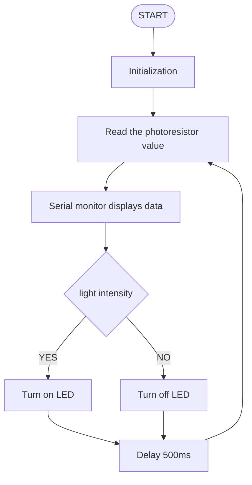

# asdasdas

#### Code Flow

```mermaid
graph TD
    A([START]) --> B[Initialization]
    B --> C[Read the photoresistor value]
    C --> D[Serial monitor displays data]
    D --> E{light intensity}
    E -- YES --> F[Turn on LED]
    E -- NO --> G[Turn off LED]
    F & G --> H[Delay 500ms]
    H --> C[Read the photoresistor value]
```

