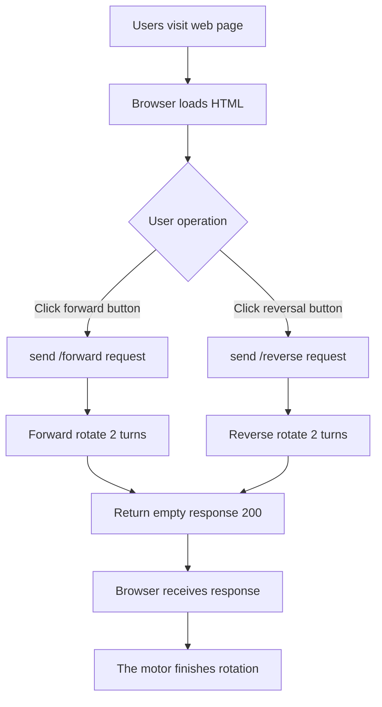
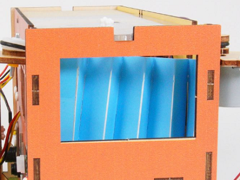
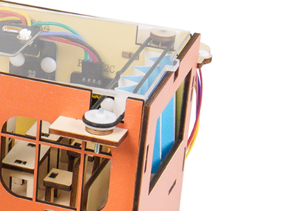
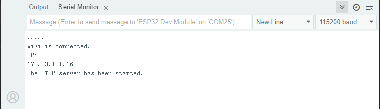
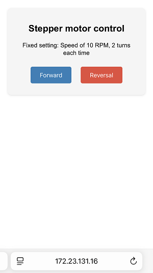
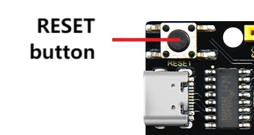

## 12. Web Page Remote Control Curtain

In the construction of smart school, Internet of Things is gradually changing the traditional management model. Here we do a practical project of web page remote control curtain to explore the application of Internet of Things in school life.

Through this project, you will not only be able to create a “compliant” curtain, but also master the core logic of the IoT system - “perception - decision - execution”, opening a window for the innovation of smart school.


#### Principle

**Mobile browser → WiFi → ESP32 → Control the motor to rotate 2 turns → curtain open/close**

1. **Mobile/Computer** Open the web page (enter the IP address of ESP32)
2. **Click the button** (forward/reverse)
3. **ESP32 receives instructions** (via WiFi)
4. **Motor rotation** (Rotate 2 turns, the curtain moves a corresponding distance)
5. **Curtain movement** (The motor drives the curtain through gears)


#### Code Flow




#### Test Code

```c++
#include <Stepper.h>
#include <WiFi.h>
#include <WebServer.h>

// motor parameters（28BYJ-48）
const int STEPS_PER_REV = 2038;  // actual step/turn
const int MOTOR_PIN1 = 14;       // IN1
const int MOTOR_PIN2 = 27;       // IN2
const int MOTOR_PIN3 = 16;       // IN3
const int MOTOR_PIN4 = 17;       // IN4

// fixed parameters
const int motorSpeed = 10;      // fixed rotational speed 10 RPM
const int rotationCount = 2;    // fixedly rotate for 2 turns

// WiFi credential
const char* ssid = "YourWiFiSSID";
const char* password = "YourWiFiPassword";

// Initialize the stepper motor (note the pin sequence: IN1-IN3-IN2-IN4)
Stepper myStepper(STEPS_PER_REV, MOTOR_PIN1, MOTOR_PIN3, MOTOR_PIN2, MOTOR_PIN4);

WebServer server(80);  // create Web server at port 80

void setup() {
  Serial.begin(115200);
  
  // connect to WiFi
  WiFi.begin(ssid, password);
  Serial.print("Connecting to WiFi...");
  while (WiFi.status() != WL_CONNECTED) {
    delay(500);
    Serial.print(".");
  }
  Serial.println("");
  Serial.println("WiFi connected");
  Serial.print("IP address: ");
  Serial.println(WiFi.localIP());
  
  // set the router
  server.on("/", handleRoot);
  server.on("/forward", []() {
    rotateMotor(rotationCount, false);
    server.send(200, "text/plain", "");
  });
  server.on("/reverse", []() {
    rotateMotor(rotationCount, true);
    server.send(200, "text/plain", "");
  });
  
  server.begin();
  Serial.println("HTTP server started");
}

void loop() {
  server.handleClient();
}

// motor rotation function
void rotateMotor(int turns, bool reverse) {
  myStepper.setSpeed(motorSpeed);
  int steps = STEPS_PER_REV * turns * (reverse ? -1 : 1);
  myStepper.step(steps);
}

// web page interface
void handleRoot() {
  String html = R"=====(
<!DOCTYPE html>
<html>
<head>
  <meta name="viewport" content="width=device-width, initial-scale=1">
  <title>Stepper Motor Control</title>
  <style>
    body { 
      font-family: Arial; 
      text-align: center; 
      margin: 0 auto; 
      padding: 20px; 
      max-width: 400px;
    }
    .control-panel {
      margin: 20px auto;
      padding: 20px;
      background: #f5f5f5;
      border-radius: 10px;
      box-shadow: 0 2px 5px rgba(0,0,0,0.1);
    }
    .btn {
      display: inline-block;
      padding: 12px 24px;
      margin: 10px;
      background: #3498db;
      color: white;
      text-decoration: none;
      border-radius: 5px;
      border: none;
      font-size: 16px;
      cursor: pointer;
      transition: background 0.3s;
    }
    .btn:hover {
      background: #2980b9;
    }
    .btn-reverse {
      background: #e74c3c;
    }
    .btn-reverse:hover {
      background: #c0392b;
    }
  </style>
</head>
<body>
  <div class="control-panel">
    <h2>Stepper Motor Control</h2>
    <p>Fixed setting: Speed 10 RPM, 2 turns each time</p>
    <button class="btn" onclick="controlMotor('forward')">Forward</button>
    <button class="btn btn-reverse" onclick="controlMotor('reverse')">Reversal</button>
  </div>

  <script>
    function controlMotor(direction) {
      fetch('/' + direction)
        .catch(err => console.log('Request failed', err));
    }
  </script>
</body>
</html>
)=====";
  
  server.send(200, "text/html", html);
}
```


#### Code Explanation

**Here covers extracurricular knowledge of HTML, CSS, and JS, so we only provide a brief introduction.**

**1. Basic settings**

```c++
#include <Stepper.h>   // stepper motor control library
#include <WiFi.h>      // ESP32 WiFi function library
#include <WebServer.h> // Web server library

// Motor parameters（28BYJ-48）
const int STEPS_PER_REV = 2038;  // Actual steps per turn
const int MOTOR_PIN1 = 14;       // IN1
const int MOTOR_PIN2 = 27;       // IN2
const int MOTOR_PIN3 = 16;       // IN3
const int MOTOR_PIN4 = 17;       // IN4

// default parameters
int motorSpeed = 10;      // The default rotation speed is 10 turns per minute
int rotationCount = 2;    // By default, it rotates 2 turns

// set the WiFi name and password
const char* ssid = "YourWiFiSSID";     // your WiFi name
const char* password = "YourWiFiPassword"; // your WiFi password

// Initialize the stepper motor (note the pin sequence: IN1-IN3-IN2-IN4)
Stepper myStepper(STEPS_PER_REV, MOTOR_PIN1, MOTOR_PIN3, MOTOR_PIN2, MOTOR_PIN4);

WebServer server(80);  // Create a Web server on port 80
```

- Introduce the necessary libraries, set the WiFi napassword, define the stepper motor pin, and initialize the Web server.

<br>

**2. Initialization (setup)**

**Connect to the WiFi network**

```c++
WiFi.begin(ssid, password);
Serial.print("Connecting to WiFi...");
while (WiFi.status() != WL_CONNECTED) {
    delay(500);
    Serial.print(".");
}
Serial.println("");
Serial.println("WiFi connected");
Serial.print("IP address: ");
Serial.println(WiFi.localIP()); // Print the obtained IP address
```

**Start the Web server**

```c++
server.begin(); // Start the Web server
Serial.println("HTTP server started");
```

<br>

**3. Main loop (loop)**

```c++
void loop() {
  server.handleClient(); // Handle client requests
}
```

- Continuously listen for HTTP requests from browsers and call the corresponding processing functions (such as `handleRoot` and `handleControl`).

<br>

**4. HTML web page content**

```c++
  String html = R"=====(
...
)=====";
  
  server.send(200, "text/html", html);  // Send the complete HTML page
```

- The code of an HTML web page. The page includes forward and reversal control buttons and parameter information, and interacts with the ESP32 backend via JavaScript.


#### Test Result

<span style="color: rgb(200, 70, 100);">Please adjust the curtain to the position shown below before uploading the code.</span>





1. After uploading the code, open the serial monitor and set the baud rate to 115200. You can see the printed IP information:

   

2. Enter the IP address on the serial monitor into your mobile phone/computer browser and you will see a simple control page.

   <span style="color: rgb(200, 70, 100);">Note: Make sure your mobile phone/computer and ESP32 are connected to the same WiFi.</span>

   

3. Click “Forward” or “Reversal” button to control the rotation of the motor.


#### FAQ

1. If nothing is printed on the serial monitor, please press the reset button on the board.

	

2. If the ESP32 has not been able to obtain an IP address, it is usually because the WiFi connection has failed. Solutions:

	- Make sure that the WiFi name and password in the code have been replaced with yours.
	- Make sure your WiFi network is 2.4GHz. ESP32 does not support 5GHz WiFi.

3. If there is no page when entering the IP address,

	- Make sure the IP address is entered correctly.
	- Check whether your mobile phone/computer is on the same network as the ESP32.