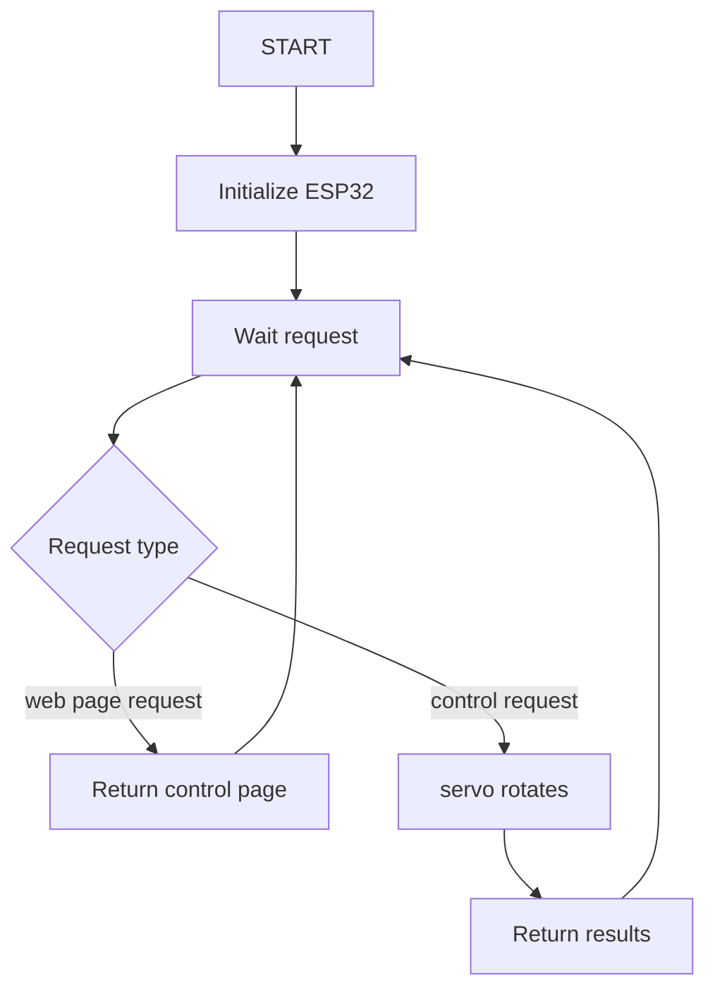
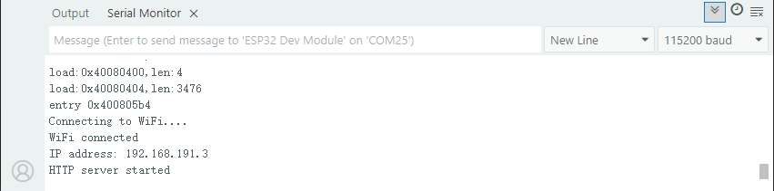
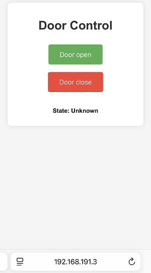

## 14. Web Page Remote Control Gate

In smart school era, smart management and remote interconnection are becoming important symbols of its modernization. In this project, with the theme of Remote Control of School Gate, we will guide you to deeply explore the innovative application of Internet of Things in school security management.

From now on, let’s protect the school with technology, build a smart management with innovation, and jointly explore the infinite possibilities of Internet of Things in education!


#### Principle

**Mobile browser → WiFi → ESP32 → Control servo rotation → Gate open/close**

1. **Mobile phone/PC** : Enter the web page to input ESP32 IP address
2. **Tap the button** (to open/close the door)
3. **ESP32 receives instructions** (through WiFi)
4. **Servo rotates** (to 180° or 90° to close or open the gate)


#### Code Flow




#### Test Code

```c++
#include <WiFi.h>
#include <WebServer.h>
#include <ESP32Servo.h>

// Replace it with your network credentials
const char* ssid = "YourWiFiSSID";
const char* password = "YourWiFiPassword";

WebServer server(80);
Servo myServo;

// Servo control pins
const int servoPin = 32;
void handleRoot() {
  // Send the HTML page
  String html = R"rawliteral(
<!DOCTYPE html>
<html lang="zh-CN">
<head>
    <meta charset="UTF-8">
    <meta name="viewport" content="width=device-width, initial-scale=1.0">
    <title>ESP32 Servo Control</title>
    <style>
        body {
            font-family: Arial, sans-serif;
            text-align: center;
            margin: 0;
            padding: 20px;
            background-color: #f5f5f5;
        }
        .container {
            max-width: 400px;
            margin: 0 auto;
            background: white;
            padding: 20px;
            border-radius: 10px;
            box-shadow: 0 0 10px rgba(0,0,0,0.1);
        }
        h1 {
            color: #333;
        }
        .btn {
            display: inline-block;
            padding: 15px 30px;
            margin: 10px;
            font-size: 18px;
            border: none;
            border-radius: 5px;
            cursor: pointer;
            transition: background-color 0.3s;
        }
        .open-btn {
            background-color: #4CAF50;
            color: white;
        }
        .close-btn {
            background-color: #f44336;
            color: white;
        }
        .btn:hover {
            opacity: 0.9;
        }
        .status {
            margin-top: 20px;
            padding: 10px;
            border-radius: 5px;
            font-weight: bold;
        }
        .open {
            background-color: #d4edda;
            color: #155724;
        }
        .closed {
            background-color: #f8d7da;
            color: #721c24;
        }
    </style>
</head>
<body>
    <div class="container">
        <h1>Door Control</h1>
        <button class="btn open-btn" onclick="controlServo(90)">Door open</button>
        <button class="btn close-btn" onclick="controlServo(180)">Door close</button>
        <div id="status" class="status">State: Unknown</div>
    </div>

    <script>
        function controlServo(angle) {
            // Update status display
            const statusElem = document.getElementById('status');
            statusElem.textContent = angle === 90 ? 'State: Door opening...' : 'State: Door closeing...';
            statusElem.className = 'status';
            
            // Send a request to ESP32
            fetch(`/control?angle=${angle}`)
                .then(response => response.text())
                .then(data => {
                    statusElem.textContent = `State: ${angle === 90 ? 'Door opened' : 'Door closed'}`;
                    statusElem.className = `status ${angle === 90 ? 'open' : 'closed'}`;
                })
                .catch(error => {
                    console.error('Error:', error);
                    statusElem.textContent = 'Operation failed. Please try again';
                    statusElem.className = 'status';
                });
        }
    </script>
</body>
</html>
)rawliteral";
  
  server.send(200, "text/html", html);
}

void handleControl() {
  if (server.hasArg("angle")) {
    int angle = server.arg("angle").toInt();
    
    // Control the servo to rotate to the specified angle
    myServo.write(angle);
    
    // Return response
    String message = angle == 90 ? "Door opened" : "Door closed";
    server.send(200, "text/plain", message);
    
    Serial.print("Servo rotates to: ");
    Serial.print(angle);
    Serial.println("°");
  } else {
    server.send(400, "text/plain", "Parameter error");
  }
}

void setup() {
  Serial.begin(115200);
  
  // Allow ESP32 to use servos
  ESP32PWM::allocateTimer(0);
  ESP32PWM::allocateTimer(1);
  ESP32PWM::allocateTimer(2);
  ESP32PWM::allocateTimer(3);
  
  // Connect to WiFi
  WiFi.begin(ssid, password);
  Serial.print("Connecting to WiFi");
  while (WiFi.status() != WL_CONNECTED) {
    delay(500);
    Serial.print(".");
  }
  Serial.println("");
  Serial.println("WiFi connected");
  Serial.print("IP address: ");
  Serial.println(WiFi.localIP());
  
  // Set servo
  myServo.setPeriodHertz(50);    // Standard 50Hz servo
  myServo.attach(servoPin, 500, 2400); // Connect to the servo pins and set the minimum and maximum pulse widths
  
  // Initialize the servo position to door-closed state(180°)
  myServo.write(180);
  
  // Set server routing
  server.on("/", handleRoot);
  server.on("/control", handleControl);
  
  // Start the server
  server.begin();
  Serial.println("HTTP server started");
}

void loop() {
  server.handleClient();
}
```


#### Code Explanation

**Here covers extracurricular knowledge of HTML, CSS, and JS, so we only provide a brief introduction.**

**1. Import libraries**

```c++
#include <WiFi.h>        // Provide WiFi connection functionality for ESP32
#include <WebServer.h>   // Provide ESP32 Web server functionality
#include <ESP32Servo.h>  // A servo control library specifically designed for ESP32
```

- **WiFi.h**: Enable ESP32 to connect to wireless networks and function as a Web server
- **WebServer.h**: Enable ESP32 to handle HTTP requests and responses
- **ESP32Servo.h**: Simplify the control of the servo and provide advanced API for controlling the servo Angle

<br>

**2. Define constants and global variables**

```c++
// your network credentials
const char* ssid = "YourWiFiSSID";      // WiFi name
const char* password = "YourWiFiPassword"; // WiFi password

WebServer server(80);  // Create a Web server instance and listen on port 80 (the default HTTP port)
Servo myServo;         // Create an instance of the servo object

const int servoPin = 32; // GPIO pin connected to the servo signal line
```

<br>

**3. Web request processing function**

**handleRoot()**

This function handles requests to the root path (“/”) and returns the complete HTML page:

```c++
void handleRoot() {
  String html = R"rawliteral( ... )rawliteral"; // Original string literal
  server.send(200, "text/html", html); // Send an HTML response
}
```

**Page structure**:

- Title includes “Door Control”.
- Two control buttons (door open and door close)
- Status display area

<br>

**handleControl()**

This function handles control requests (“/control”):

```c++
void handleControl() {
  if (server.hasArg("angle")) { // Check if there are Angle parameters
    int angle = server.arg("angle").toInt(); // Obtain the Angle value and convert it to an integer
    
    myServo.write(angle); // Control the servo to rotate to the specified angle
    
    // Return response
    String message = angle == 90 ? "Door opened" : "Door closed";
    server.send(200, "text/plain", message);
    
    // Debug information is output via the serial port
    Serial.print("Servo rotates to: ");
    Serial.print(angle);
    Serial.println("°");
  } else {
    server.send(400, "text/plain", "Parameter error"); // Error handling
  }
}
```

<br>

**4. setup()**

```c++
void setup() {
  Serial.begin(115200); // Initialize serial communication with a baud rate of 115200
  
  // Allocate the PWM timer. The ESP32 has four timers available for PWM
  ESP32PWM::allocateTimer(0);
  ESP32PWM::allocateTimer(1);
  ESP32PWM::allocateTimer(2);
  ESP32PWM::allocateTimer(3);
  
  // Connect to WiFi
  WiFi.begin(ssid, password);
  Serial.print("Connecting to WiFi");
  while (WiFi.status() != WL_CONNECTED) { // Wait for it to be connected
    delay(500);
    Serial.print(".");
  }
  Serial.println("");
  Serial.println("WiFi connected");
  Serial.print("IP address: ");
  Serial.println(WiFi.localIP()); // Print the IP address of the ESP32
  
  // Set servo parameters
  myServo.setPeriodHertz(50);    // Standard 50Hz servo(period 20ms)
  myServo.attach(servoPin, 500, 2400); // pulse widths(500-2400μs)
  
  // Initialize the servo position to door-closed state(180°)
  myServo.write(180);
  
  // Set server routing
  server.on("/", handleRoot);        // Root path request
  server.on("/control", handleControl); // Control request
  
  // Start the server
  server.begin();
  Serial.println("HTTP server started");
}
```

<br>

**5. loop()**

```c++
void loop() {
  server.handleClient(); // Handle client requests
}
```

This function constantly checks and processes HTTP requests from the client to keep the Web server running.


#### Test Result

1. After uploading the code, open the serial monitor and set the baud rate to 115200. You can see the printed IP information:

   

2. Enter this IP address in the browser of your mobile phone or computer to access the gate control page.

   - “Door open”: to open the gate
   - “Door close”: to close the gate
   - “State”: the current state of the gate
   
   <span style="color: rgb(200, 70, 100);">Note: Make sure your mobile phone/computer and ESP32 are connected to the same WiFi.</span>
   
   


#### FAQ

1. If nothing is printed on the serial monitor, please press the reset button on the board.

   

2. If the ESP32 has not been able to obtain an IP address, it is usually because the WiFi connection has failed. Solutions:

   - Make sure that the WiFi name and password in the code have been replaced with yours.
   - Make sure your WiFi network is 2.4GHz. ESP32 does not support 5GHz WiFi.

3. If there is no page when entering the IP address,

	- Make sure the IP address is entered correctly.
	- Check whether your mobile phone/computer is on the same network as the ESP32.