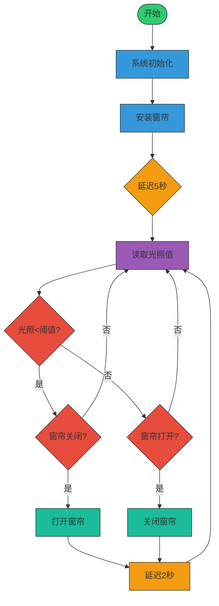

## 10. 光控自动窗帘

这节课我们要制作一个智能光控自动窗帘系统，当光线变强时，光敏传感器会像敏锐的眼睛一样察觉变化，步进电机就会自动拉开窗帘；光线变暗时，它又会悄悄合上窗帘，就像一个贴心的光线小管家！

### 10.1 步进电机

28BYJ-48是一款经济实用的5线4相减速步进电机，内置1/64减速齿轮箱，提供高扭矩和精准的步进控制，常被用于智能家居、教学实验和小型自动化项目。


#### 参数

工作电压 ：DC 5V 

相数 ：4相（5线制：4相+1公共端）

绕组电阻 ：50Ω±10%（每相）

驱动方式 ：单极驱动

减速比：1：64

输出轴步距角：5.625°

理论步数：64步（输入轴）→4096步/转（输出轴）

实际常用步数：2038步/转（因齿轮间隙的工程近似值）

电机直径：28mm

轴长：8mm（输出轴）

重量：约30g

线序：红(COM)、橙(A)、黄(B)、粉(C)、蓝(D)


#### 原理

**1. 电机基本结构**


28BYJ-48 是单极式永磁步进电机（带减速齿轮箱），包含：

- 定子：4组线圈（8个引出线）
- 转子：永磁体（经齿轮箱减速输出）
- 减速比：1:64（实际输出轴转1圈，转子需转64圈）
- 步距角：5.625°/64 ≈ 0.088°/步（经减速后）

**2. 驱动原理核心**

通过按顺序激励定子线圈产生旋转磁场，吸引永磁转子转动：

**线圈连接方式（单极5线式）：**


共5根线：4个线圈端 + 1个公共端

**工作模式**：

全步模式：每次只激活一个线圈（2048步/圈），步距角5.625°，64步/圈（转子）

- 例：A → B → C → D → A...（正转）
- 例：A → D → C → B → A...（反转）


1. 避免堵转：可能烧毁线圈
2. 最低转速限制：低于5RPM可能出现抖动
3. 需配合消抖电路：机械齿轮存在回差
4. 不要直接拔插电线：可能产生反电动势


#### ULN2003驱动模块


由于驱动 28BYJ-48 步进电机需要300mA以上的大电流，而ESP32主板的GPIO引脚最大只能输出40mA的小电流，所以需要ULN2003驱动板来放大电流信号并保护主板。


#### 实验代码

<span style="color: rgb(200, 70, 100);">上传代码前请先按下图所示调整窗帘的位置。</span>


```c++
#include <Stepper.h>             // 提供了控制步进电机的基本功能

// 电机参数（28BYJ-48）
const int STEPS_PER_REV = 2038;  // 实际步数/圈（不同电机可能有差异）
const int MOTOR_PIN1 = 14;       // IN1
const int MOTOR_PIN2 = 27;       // IN2
const int MOTOR_PIN3 = 16;       // IN3
const int MOTOR_PIN4 = 17;       // IN4

// 用户可调参数
int motorSpeed = 10;      // 转速(RPM)，建议5-12，超过15极易堵转
int rotationCount = 2;    // 转动圈数
bool reverseDirection = false; // 反转标志位

// 初始化步进电机（注意引脚顺序IN1-IN3-IN2-IN4）
Stepper myStepper(STEPS_PER_REV, MOTOR_PIN1, MOTOR_PIN3, MOTOR_PIN2, MOTOR_PIN4);

void setup() {
  Serial.begin(115200);
}

void loop() {
  // 反转测试
  Serial.println("拉开窗帘");
  rotateMotor(rotationCount, true);
  delay(1000);

  // 正转测试
  Serial.println("关闭窗帘");
  rotateMotor(rotationCount, false);
  delay(1000);  // 停顿1秒
}

// 电机转动函数
void rotateMotor(int turns, bool reverse) {
  myStepper.setSpeed(motorSpeed);
  int steps = STEPS_PER_REV * turns * (reverse ? -1 : 1);
  myStepper.step(steps);
}
```


#### 代码说明

**1. 头文件与参数说明**

```c++
#include <Stepper.h>             // 提供了控制步进电机的基本功能

// 电机参数（28BYJ-48）
const int STEPS_PER_REV = 2038;  // 实际步数/圈（不同电机可能有差异）
const int MOTOR_PIN1 = 14;       // IN1
const int MOTOR_PIN2 = 27;       // IN2
const int MOTOR_PIN3 = 16;       // IN3
const int MOTOR_PIN4 = 17;       // IN4

// 用户可调参数
int motorSpeed = 10;      // 转速(RPM)，建议5-12，超过15极易堵转
int rotationCount = 2;    // 转动圈数
bool reverseDirection = false; // 反转标志位

// 初始化步进电机（注意引脚顺序IN1-IN3-IN2-IN4）
Stepper myStepper(STEPS_PER_REV, MOTOR_PIN1, MOTOR_PIN3, MOTOR_PIN2, MOTOR_PIN4);
```

<br>

**2. 主循环(loop函数)**

```c++
void loop() {
  // 反转测试
  Serial.println("拉开窗帘");
  rotateMotor(rotationCount, true);
  delay(1000);

  // 正转测试
  Serial.println("关闭窗帘");
  rotateMotor(rotationCount, false);
  delay(1000);  // 停顿1秒
}
```

- 先反转指定圈数，停顿1秒
- 再正转指定圈数，停顿1秒
- 循环执行上述过程


**3. 电机控制函数**

```c++
void rotateMotor(int turns, bool reverse) {
  myStepper.setSpeed(motorSpeed);
  int steps = STEPS_PER_REV * turns * (reverse ? -1 : 1);
  myStepper.step(steps);
}
```

**参数说明**：

- `turns`：定义要旋转的圈数（整数）
- `reverse`：布尔值，定义旋转方向（`true`表示反转，`false`表示正转）

<br>

**设置电机转速**

```c++
myStepper.setSpeed(motorSpeed);
```

- 设置转速为全局变量`motorSpeed`的值，建议5-12，超过15极易堵转

**计算总步数**

```c++
int steps = STEPS_PER_REV * turns * (reverse ? -1 : 1);
```

1. `STEPS_PER_REV`（每圈步数，2038） × `turns`（圈数）→ 得到总步数

2. 根据 `reverse` 参数决定方向：

   - 正转：步数为正（如2038×2=4076）

   - 反转：步数为负（如2038×2×-1=-4076）
   
     <br>
   
     `reverse ? -1 : 1` 是三元运算符，语法如下：
   
   ```
   条件 ? 表达式1 : 表达式2
   ```
   
   - 条件：一个布尔表达式，结果为 `true` 或 `false`。
   - 表达式1：如果条件为 `true`，则返回 `表达式1` 的值。
   - 表达式2：如果条件为 `false`，则返回 `表达式2` 的值。

**执行电机转动**

```c++
myStepper.step(steps);
```


#### 实验结果

<span style="color: rgb(200, 70, 100);">上传代码前请先按下图所示调整窗帘的位置。</span>


代码上传成功后，循环执行以下操作：

- 步进电机转动，窗帘关闭，停顿1秒
- 步进电机转动，窗帘打开，停顿1秒

==动图==


#### 常见问题解决

1. 电机不转
   - 检查供电是否充足；引脚是否正确连接
2. 电机抖动
   - 适当降低转速
4. 电机发热严重
   - 减少连续运行时间


### 10.2 光控自动窗帘

在前面的学习中，我们已经掌握了光敏传感器检测光照强度的原理和步进电机的精准控制功能。在这节课中，我们将这些技术结合起来，动手制作一个智能光控窗帘系统！通过光敏传感器实时监测教室内光照强度，当检测到阳光过强时，系统会自动控制步进电机关闭窗帘；当光线变弱时，窗帘又会自动打开。这个系统就像一位贴心的教室管理员，既能保护师生免受强光干扰，又能智能调节室内光线环境。让我们一起来打造这个既实用又充满科技感的智能装置吧！


#### 流程图




#### 实验代码

<span style="color: rgb(200, 70, 100);">上传代码前请先取下窗帘，待电机初始化后在5秒内按下图所示调整窗帘的位置。</span>


```c++
#include <Stepper.h>

// 电机参数（28BYJ-48）
const int STEPS_PER_REV = 2038;  // 实际步数/圈
const int MOTOR_PIN1 = 14;       // IN1
const int MOTOR_PIN2 = 27;       // IN2 
const int MOTOR_PIN3 = 16;       // IN3
const int MOTOR_PIN4 = 17;       // IN4

// 光敏传感器
const int LIGHT_SENSOR_PIN = 34; // 光敏模块接GPIO34
const int LIGHT_THRESHOLD = 2000; // 光照阈值（根据实际调整）

// 电机控制参数
const int MOTOR_SPEED = 10;      // 转速(RPM)
bool isCurtainOpen = true;       // 默认窗帘初始状态为打开
const int TURNS = 2;             // 转动圈数设为2圈

Stepper myStepper(STEPS_PER_REV, MOTOR_PIN1, MOTOR_PIN3, MOTOR_PIN2, MOTOR_PIN4);

void setup() {
  Serial.begin(115200);
  pinMode(LIGHT_SENSOR_PIN, INPUT);
  myStepper.setSpeed(MOTOR_SPEED);
  closeCurtain(); // 设置窗帘状态为关闭
  delay(5000);    // 安装等待时间
}

void loop() {
  int lightValue = analogRead(LIGHT_SENSOR_PIN);
  Serial.print("光照值: ");
  Serial.println(lightValue);

  if(lightValue < LIGHT_THRESHOLD && !isCurtainOpen) {
    // 光线不足且窗帘关闭时，打开窗帘
    openCurtain();
  } 
  else if(lightValue >= LIGHT_THRESHOLD && isCurtainOpen) {
    // 光线充足且窗帘打开时，关闭窗帘
    closeCurtain();
  }
  
  delay(2000); // 每2秒检测一次
}

void openCurtain() {
  myStepper.step(-STEPS_PER_REV * TURNS); // 反转2圈
  isCurtainOpen = true;
}

void closeCurtain() {
  myStepper.step(STEPS_PER_REV * TURNS); // 正转2圈
  isCurtainOpen = false;
}
```


#### 代码说明

**1. 初始化设置(setup函数)**

```c++
void setup() {
  Serial.begin(115200);
  pinMode(LIGHT_SENSOR_PIN, INPUT);
  myStepper.setSpeed(MOTOR_SPEED);
  closeCurtain(); // 初始化关闭状态
  delay(5000);    // 安装等待时间
}
```

- 预关闭窗帘确保初始状态一致
- 提供5秒延时安装调整

<br>

**2. 主循环(loop函数)**

```c++
void loop() {
  int lightValue = analogRead(LIGHT_SENSOR_PIN);
  Serial.print("光照值: ");
  Serial.println(lightValue);

  if(lightValue < LIGHT_THRESHOLD && !isCurtainOpen) {
    openCurtain();
  } 
  else if(lightValue >= LIGHT_THRESHOLD && isCurtainOpen) {
    closeCurtain();
  }
  delay(2000); // 检测间隔
}
```

- 每2秒读取一次光照值
- 双条件判断确保只在状态需要改变时才动作

<br>

**3. 电机动作函数**

**开窗帘函数**

```c++
void openCurtain() {
  myStepper.step(-STEPS_PER_REV * TURNS); // 反转
  isCurtainOpen = true;
  Serial.println("窗帘已打开");
}
```

- 计算电机转动总步数，反转
- 状态更新，保证软件状态与实际物理状态同步

关窗帘函数同理。


#### 实验结果

<span style="color: rgb(200, 70, 100);">上传代码前请先取下窗帘，待电机初始化后在5秒内按下图所示调整窗帘的位置。</span>


代码上传成功后，根据教室内的光照值，窗帘自动作出相应的动作：

- 光线不足且窗帘关闭时，打开窗帘
- 光线充足且窗帘打开时，关闭窗帘