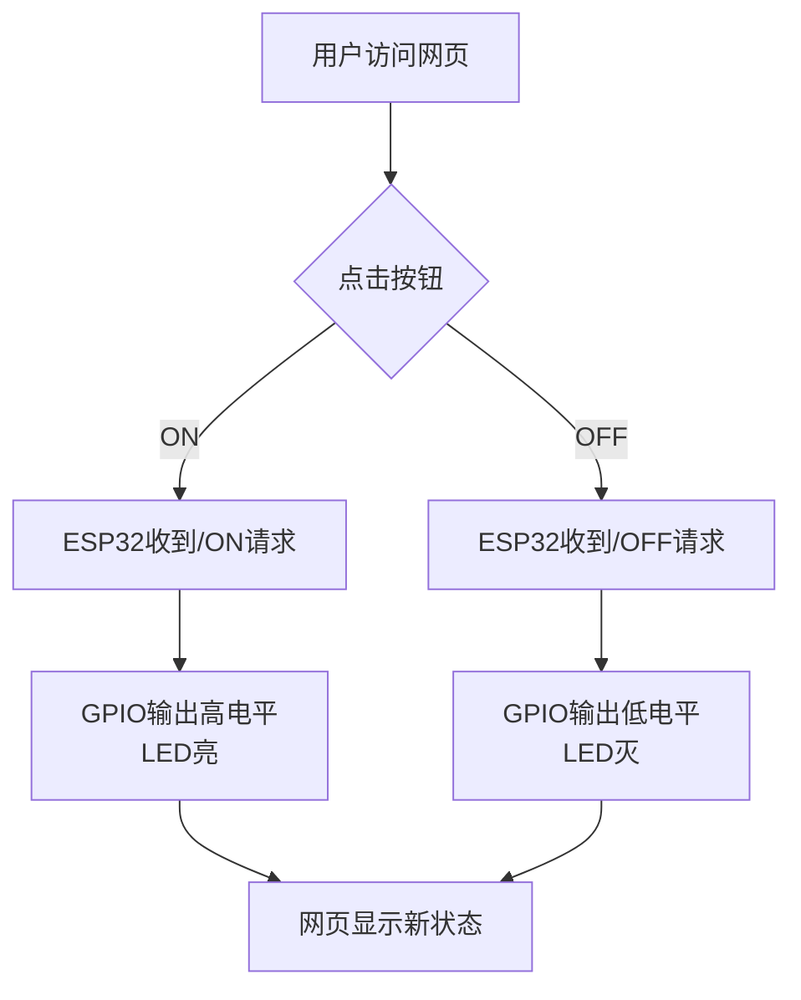

## 11. 网页远程控制LED

网页远程控制LED实验是智慧校园物联网应用的微型实践，通过ESP32搭建Web服务器，实现浏览器对LED的远程操控，直接映射校园中智能照明、设备管理等真实场景。

本课将带领你探索物联网的奇妙世界！通过ESP32开发板，编写代码，就能用手机网页远程控制LED灯的开关。一起来完成你的第一个"智慧校园"物联网项目吧！

==补手机页面和结构的图==


#### 原理

**注意：此课程涉及HTML、CSS、JS等课外知识， 只做简单介绍。**


**关键步骤：**

**（1）ESP32 变身微型服务器**

- ESP32 连接 WiFi 后，会变成一个**微型Web服务器**（就像一台超迷你的电脑）。
- 它会有一个局域网 IP 地址（比如 `172.23.131.16`），其他连接 **同一WiFi** 的设备都能访问它。

**（2）网页交互设计**

- ESP32 托管一个简单的网页，网页上有两个按钮：
   "ON" 按钮   → 点击后发送 `/ON` 请求
   "OFF" 按钮 → 点击后发送 `/OFF` 请求

**（3）请求处理流程**

1. 点击网页按钮 → 浏览器向 ESP32 发送请求
2. ESP32 接收请求
2. ESP32 收到请求后，通过 GPIO 引脚控制 LED：
   - 开灯：引脚输出高电平 → LED 通电发光
   - 关灯：引脚输出低电平 → LED 断电熄灭

**（4）实时反馈**

网页通过 JavaScript 动态更新状态，无需刷新页面（类似你刷手机时的即时响应）。

<br>

**技术三要素**

| 要素             | 作用                          | 类比                     |
| ---------------- | ----------------------------- | ------------------------ |
| **WiFi通信**     | 让浏览器和ESP32能对话         | 像两个人用对讲机通话     |
| **Web服务器**    | 托管网页并处理按钮点击请求    | 像餐厅服务员接收你的点单 |
| **GPIO数字输出** | 把网页指令变成实际电流控制LED | 像你用手按下物理开关     |


#### 流程图




#### 实验代码

<span style="color: rgb(200, 70, 100);">请将代码里的 WiFi 名称和密码替换为你的。</span>

```c++
#include <WiFi.h>
#include <WebServer.h>

// 设置WiFi名称和密码
const char* ssid = "YourWiFiSSID";     // 替换为你的WiFi名称
const char* password = "YourWiFiPassword"; // 替换为你的WiFi密码

// 定义LED引脚
const int ledPin = 12;  // GPIO12

WebServer server(80);  // 创建Web服务器对象，端口80

// HTML网页内容
const char* htmlContent = R"rawliteral(
<!DOCTYPE HTML>
<html>
<head>
  <meta name="viewport" content="width=device-width, initial-scale=1">
  <title>ESP32 LED control</title>
  <style>
    body { 
      font-family: Arial, sans-serif; 
      text-align: center; 
      margin: 0 auto; 
      padding-top: 50px; 
    }
    .button {
      padding: 10px 20px;
      font-size: 16px;
      margin: 10px;
      cursor: pointer;
      background-color: #4CAF50;
      color: white;
      border: none;
      border-radius: 5px;
    }
    .button-off {
      background-color: #f44336;
    }
  </style>
</head>
<body>
  <h1>ESP32 LED control</h1>
  <p>LED status: <span id="ledState">%LEDSTATE%</span></p>
  <p>
    <button class="button" onclick="controlLED('ON')">LED ON</button>
    <button class="button button-off" onclick="controlLED('OFF')">LED  OFF</button>
  </p>
  <script>
    function controlLED(state) {
      var xhr = new XMLHttpRequest();
      xhr.open("GET", "/" + state, true);
      xhr.send();
      
      // 更新页面状态显示
      document.getElementById("ledState").innerHTML = (state === 'ON') ? 'ON' : 'OFF';
    }
  </script>
</body>
</html>
)rawliteral";

void handleRoot() {
  // 获取当前LED状态
  String ledState = (digitalRead(ledPin)) ? "开启" : "关闭";
  
  // 替换HTML中的占位符
  String html = htmlContent;
  html.replace("%LEDSTATE%", ledState);
  
  server.send(200, "text/html", html);
}

void handleLEDOn() {
  digitalWrite(ledPin, HIGH);
  server.send(200, "text/plain", "LED已开启");
}

void handleLEDOff() {
  digitalWrite(ledPin, LOW);
  server.send(200, "text/plain", "LED已关闭");
}

void handleNotFound() {
  server.send(404, "text/plain", "404: Not found");
}

void setup() {
  Serial.begin(115200);
  pinMode(ledPin, OUTPUT);
  digitalWrite(ledPin, LOW);  // 初始关闭LED

  // 连接WiFi
  WiFi.begin(ssid, password);
  Serial.println("正在连接WiFi...");
  
  while (WiFi.status() != WL_CONNECTED) {
    delay(500);
    Serial.print(".");
  }
  
  Serial.println("");
  Serial.println("WiFi is connected.");
  Serial.println("IP: ");
  Serial.println(WiFi.localIP());

  // 设置服务器路由
  server.on("/", handleRoot);
  server.on("/ON", handleLEDOn);
  server.on("/OFF", handleLEDOff);
  server.onNotFound(handleNotFound);
  
  // 启动服务器
  server.begin();
  Serial.println("The HTTP server has been started.");
}

void loop() {
  server.handleClient();  // 处理客户端请求
}
```


#### 代码说明

**注意：此课程涉及HTML、CSS、JS等课外知识， 只做简单介绍。**

**1. 基础设置**

```c++
#include <WiFi.h>
#include <WebServer.h>

const char* ssid = "YourWiFiSSID";     // WiFi名称
const char* password = "YourWiFiPassword"; // WiFi密码
const int ledPin = 12;  // LED连接的GPIO引脚（ESP32的GPIO12）
WebServer server(80);   // 创建一个Web服务器，端口80
```

- 引入必要的库，设置WiFi账号密码，定义LED引脚，初始化Web服务器。

<span style="color: rgb(200, 70, 100);">注意：请将代码里的 WiFi 名称和密码替换为你的。</span>

<br>

**2. 初始化设置(setup函数)**

```c++
void setup() {
  Serial.begin(115200);
  pinMode(ledPin, OUTPUT);     // 设置LED引脚为输出模式
  digitalWrite(ledPin, LOW);   // 初始关闭LED

  WiFi.begin(ssid, password);  // 连接WiFi
  while (WiFi.status() != WL_CONNECTED) {
    delay(500);
    Serial.print(".");
  }
  
  Serial.println("\nWiFi已连接");
  Serial.print("IP地址: ");
  Serial.println(WiFi.localIP()); // 打印ESP32的IP地址

  // 绑定路径和处理函数
  server.on("/", handleRoot);
  server.on("/ON", handleLEDOn);
  server.on("/OFF", handleLEDOff);
  server.onNotFound(handleNotFound);
  
  server.begin(); // 启动Web服务器
  Serial.println("HTTP服务器已启动");
}
```

1. 初始化串口（用于调试输出）。
2. 设置LED引脚并初始化为关闭状态。
3. 连接WiFi，等待连接成功并打印IP地址。
4. 绑定URL路径到对应的处理函数。
5. 启动Web服务器。

<br>

**3. 主循环(loop函数)**

```c++
void loop() {
  server.handleClient(); // 处理客户端（浏览器）请求
}
```

- 持续监听来自浏览器的HTTP请求，并调用对应的处理函数（如`handleRoot`、`handleLEDOn`等）。

<br>

**4. HTML网页内容**

```c++
const char* htmlContent = R"rawliteral(
<!DOCTYPE HTML>
...
</html>
)rawliteral";
```

- HTML网页的代码，页面有两个按钮：**打开LED**（发送`/ON`请求）和**关闭LED**（发送`/OFF`请求）。

<br>

**5. 处理HTTP请求**

**根路径请求（显示网页）**

```c++
void handleRoot() {
  String ledState = (digitalRead(ledPin)) ? "开启" : "关闭"; // 读取LED状态
  String html = htmlContent;
  html.replace("%LEDSTATE%", ledState); // 动态更新网页中的LED状态
  server.send(200, "text/html", html);  // 发送网页给客户端
}
```

- 当访问ESP32的IP地址时，返回HTML网页，并显示当前LED状态。

**控制LED的请求**

```c++
void handleLEDOn() {
  digitalWrite(ledPin, HIGH);  // 打开LED
  server.send(200, "text/plain", "LED已开启"); // 返回响应
}

void handleLEDOff() {
  digitalWrite(ledPin, LOW);   // 关闭LED
  server.send(200, "text/plain", "LED已关闭");
}
```

- **功能**：当点击网页按钮时，ESP32收到`/ON`或`/OFF`请求，控制LED亮灭。


#### 实验结果

1. 代码上传成功后，打开串口监视器，设置波特率为115200，可以看到打印的IP信息：

   

2. 将串口监视器打印的IP地址输入到手机/电脑浏览器并打开，你将看到一个简单的控制页面。

   <span style="color: rgb(200, 70, 100);">注意：确保手机/电脑与ESP32连接到同一个 WiFi 。</span>

   

3. 点击"LED ON"或"LED OFF"按钮控制LED灯的状态。


#### 常见问题解决

1. 若串口监视器无任何信息打印，请按下主板的复位键：

   

2. 若ESP32 一直没有获取到 IP 地址，通常是因为 WiFi 连接失败，解决办法：
   - 确保代码里的 WiFi 名称和密码已经替换为你的。
   - 确保你的 WiFi 网络是 2.4GHz 的，ESP32不支持 5GHz WiFi。
3. 若输入IP地址无页面，解决办法：
   - 确保IP地址输入正确。
   - 检查手机/电脑是否与ESP32在同一网络。

