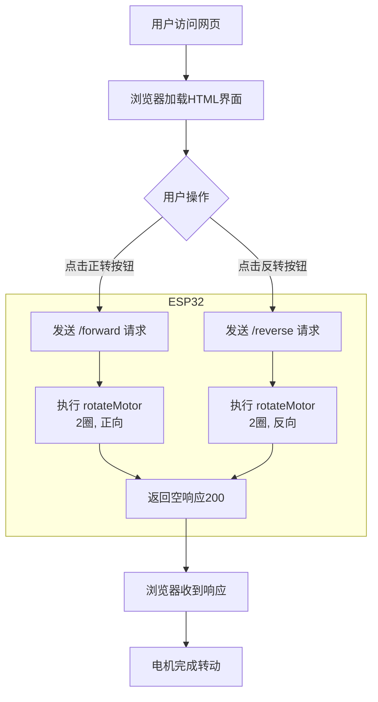

## 12. 网页远程控制智能窗帘

 在智慧校园的建设中，物联网技术正逐步改变传统的校园管理模式。本课程以“网页远程控制智能窗帘”为实践项目，探索物联网在校园生活中的实际应用。

通过本项目，你不仅能做出一个“会听话”的窗帘，更能掌握物联网系统的核心逻辑——“感知-决策-执行”，为智慧校园的创新打开一扇窗。

==补手机页面和结构的图==


#### 原理

**手机浏览器 → WiFi → ESP32 → 控制电机转2圈 → 窗帘开/关**

==补图==


1. **手机/电脑** 打开网页（输入ESP32的IP地址）
2. **点击按钮**（正转/反转）
3. **ESP32收到指令**（通过WiFi）
4. **电机转动**（转2圈，窗帘移动对应距离）
5. **窗帘移动**（电机通过齿轮带动窗帘）


#### 流程图




#### 实验代码

```c++
#include <Stepper.h>   // 步进电机控制库
#include <WiFi.h>      // ESP32 WiFi功能库
#include <WebServer.h> // 网页服务器库

// 电机参数（28BYJ-48）
const int STEPS_PER_REV = 2038;  // 实际步数/圈
const int MOTOR_PIN1 = 14;       // IN1
const int MOTOR_PIN2 = 27;       // IN2
const int MOTOR_PIN3 = 16;       // IN3
const int MOTOR_PIN4 = 17;       // IN4

// 默认参数
int motorSpeed = 10;      // 默认转速10转/分钟
int rotationCount = 2;    // 默认转动2圈

// WiFi凭证
const char* ssid = "YourWiFiSSID";         // 修改为你的WiFi名称
const char* password = "YourWiFiPassword"; // 修改为你的WiFi密码

// 初始化步进电机（注意引脚顺序IN1-IN3-IN2-IN4）
Stepper myStepper(STEPS_PER_REV, MOTOR_PIN1, MOTOR_PIN3, MOTOR_PIN2, MOTOR_PIN4);

WebServer server(80);  // 创建Web服务器，端口80

void setup() {
  Serial.begin(115200);
  
  // 连接WiFi
  WiFi.begin(ssid, password);
  Serial.print("Connecting to WiFi...");
  while (WiFi.status() != WL_CONNECTED) {
    delay(500);
    Serial.print(".");
  }
  Serial.println("");
  Serial.println("WiFi connected");
  Serial.print("IP address: ");
  Serial.println(WiFi.localIP()); // 打印获取到的IP地址
  
  // 设置路由
  server.on("/", handleRoot);           // 根目录请求
  server.on("/control", handleControl); // 控制请求
  
  server.begin(); // 启动Web服务器
  Serial.println("HTTP server started");
}

void loop() {
  server.handleClient(); // 处理客户端请求
}

// 电机转动函数
void rotateMotor(int turns, bool reverse) {
  myStepper.setSpeed(motorSpeed); // 设置转速
  int steps = STEPS_PER_REV * turns * (reverse ? -1 : 1); // 计算总步数(方向由reverse决定)
  myStepper.step(steps); // 执行转动
}

// 处理根目录请求
void handleRoot() {
  String html = R"=====(
<!DOCTYPE html>
<html>
<head>
  <meta name="viewport" content="width=device-width, initial-scale=1">
  <title>ESP32 Stepper motor control</title>
  <style>
    body { font-family: Arial; text-align: center; margin: 0 auto; padding: 20px; }
    .control { margin: 20px; padding: 15px; background: #f0f0f0; border-radius: 10px; }
    input, button { padding: 10px; margin: 5px; }
    button { background: #4CAF50; color: white; border: none; cursor: pointer; }
    button:hover { background: #45a049; }
  </style>
</head>
<body>
  <h1>ESP32 Stepper motor control</h1>
  <div class="control">
    <h2>Motor control</h2>
    <button onclick="controlMotor('forward')">Forward rotation</button>
    <button onclick="controlMotor('reverse')">Reverse rotation</button>
  </div>
  <div class="control">
    <h2>Parameter setting</h2>
    <label for="speed">Rotation speed (RPM): </label>
    <input type="number" id="speed" value=")"=====" + String(motorSpeed) + R"=====(" min="1" max="15"><br>
    <label for="turns">Number of rotations: </label>
    <input type="number" id="turns" value=")"=====" + String(rotationCount) + R"=====(" min="1" max="10"><br>
    <button onclick="updateSettings()">Update settings</button>
  </div>
  <script>
    function controlMotor(direction) {
      fetch('/control?dir=' + direction)
        .then(response => response.text())
        .then(data => console.log(data));
    }
    function updateSettings() {
      let speed = document.getElementById('speed').value;
      let turns = document.getElementById('turns').value;
      fetch('/control?speed=' + speed + '&turns=' + turns)
        .then(response => response.text())
        .then(data => console.log(data));
    }
  </script>
</body>
</html>
)=====";
  
  server.send(200, "text/html", html);  // 发送完整HTML页面
}

// 处理控制请求
void handleControl() {
  // 处理方向控制
  if (server.hasArg("dir")) {          // 检查是否有方向参数
    String direction = server.arg("dir"); // 获取参数值
    if (direction == "forward") {
      rotateMotor(rotationCount, false); // 正转
      server.send(200, "text/plain", "电机正转 " + String(rotationCount) + " 圈");
    } else if (direction == "reverse") {
      rotateMotor(rotationCount, true); // 反转
      server.send(200, "text/plain", "电机反转 " + String(rotationCount) + " 圈");
    }
  }
  
  // 处理参数设置
  if (server.hasArg("speed") || server.hasArg("turns")) {
    if (server.hasArg("speed")) {
      motorSpeed = server.arg("speed").toInt();
      motorSpeed = constrain(motorSpeed, 1, 15); // 限制在1-15 RPM之间
    }
    if (server.hasArg("turns")) {
      rotationCount = server.arg("turns").toInt();
      rotationCount = constrain(rotationCount, 1, 10); // 限制在1-10圈之间
    }
    server.send(200, "text/plain", "参数已更新: 转速=" + String(motorSpeed) + " RPM, 圈数=" + String(rotationCount));
  }
}
```


#### 代码说明

**注意：此课程涉及HTML、CSS、JS等课外知识， 只做简单介绍。**

**1. 基础设置**

```c++
#include <Stepper.h>   // 步进电机控制库
#include <WiFi.h>      // ESP32 WiFi功能库
#include <WebServer.h> // 网页服务器库

// 电机参数（28BYJ-48）
const int STEPS_PER_REV = 2038;  // 实际步数/圈
const int MOTOR_PIN1 = 14;       // IN1
const int MOTOR_PIN2 = 27;       // IN2
const int MOTOR_PIN3 = 16;       // IN3
const int MOTOR_PIN4 = 17;       // IN4

// 默认参数
int motorSpeed = 10;      // 默认转速10转/分钟
int rotationCount = 2;    // 默认转动2圈

// WiFi凭证
const char* ssid = "YourWiFiSSID";         // 修改为你的WiFi名称
const char* password = "YourWiFiPassword"; // 修改为你的WiFi密码

// 初始化步进电机（注意引脚顺序IN1-IN3-IN2-IN4）
Stepper myStepper(STEPS_PER_REV, MOTOR_PIN1, MOTOR_PIN3, MOTOR_PIN2, MOTOR_PIN4);

WebServer server(80);  // 创建Web服务器，端口80
```

- 引入必要的库，设置WiFi账号密码，定义步进电机引脚，初始化Web服务器。

<br>

**2. 初始化设置(setup函数)**

**连接WiFi网络**

```c++
WiFi.begin(ssid, password);
Serial.print("Connecting to WiFi...");
while (WiFi.status() != WL_CONNECTED) {
    delay(500);
    Serial.print(".");
}
Serial.println("");
Serial.println("WiFi connected");
Serial.print("IP address: ");
Serial.println(WiFi.localIP()); // 打印获取到的IP地址
```

**启动Web服务器**

```c++
server.on("/", handleRoot);           // 根目录请求
server.on("/control", handleControl); // 控制请求

server.begin(); // 启动Web服务器
Serial.println("HTTP server started");
```

<br>

**3. 主循环(loop函数)**

```c++
void loop() {
  server.handleClient(); // 处理客户端请求
}
```

- 持续监听来自浏览器的HTTP请求，并调用对应的处理函数（如`handleRoot`、`handleControl`等）。

<br>

**4. HTML网页内容**

**服务器返回控制页面**

```c++
  String html = R"=====(
...
)=====";
  
  server.send(200, "text/html", html);  // 发送完整HTML页面
```

- HTML网页的代码，页面包含正反转控制按钮和参数设置界面，并通过JavaScript与ESP32后端交互。

**用户点击按钮浏览器发送请求**

```javascript
// HTML中的JavaScript代码：
function controlMotor(direction) {
  fetch('/control?dir=' + direction)  // 发送GET请求到/control
    .then(response => response.text())
    .then(data => console.log(data));
}
```

<br>

**5. 电机控制阶段**

**执行电机动作**

```c++
if (direction == "forward") {
  rotateMotor(rotationCount, false); // 正转
} else if (direction == "reverse") {
  rotateMotor(rotationCount, true);  // 反转
}
```


#### 实验结果

<span style="color: rgb(200, 70, 100);">上传代码前请先将窗帘调整至下图所示位置：</span>


1. 代码上传成功后，打开串口监视器，设置波特率为115200，可以看到打印的IP信息：

   

2. 将串口监视器打印的IP地址输入到手机/电脑浏览器并打开，你将看到一个简单的控制页面。

   <span style="color: rgb(200, 70, 100);">注意：确保手机/电脑与ESP32连接到同一个 WiFi 。</span>

   

3. 点击"Forward"或"Reversal"按钮控制电机正反转。

   - 电机反转，打开窗帘
   - 电机正转，关闭窗帘


#### 常见问题解决

1. 若串口监视器无任何信息打印，请按下主板的复位键：

   

2. 若ESP32 一直没有获取到 IP 地址，通常是因为 WiFi 连接失败，解决办法：

   - 确保代码里的 WiFi 名称和密码已经替换为你的。
   - 确保你的 WiFi 网络是 2.4GHz 的，ESP32不支持 5GHz WiFi。

3. 若输入IP地址无页面，解决办法：

   - 确保IP地址输入正确。
   - 检查手机/电脑是否与ESP32在同一网络。