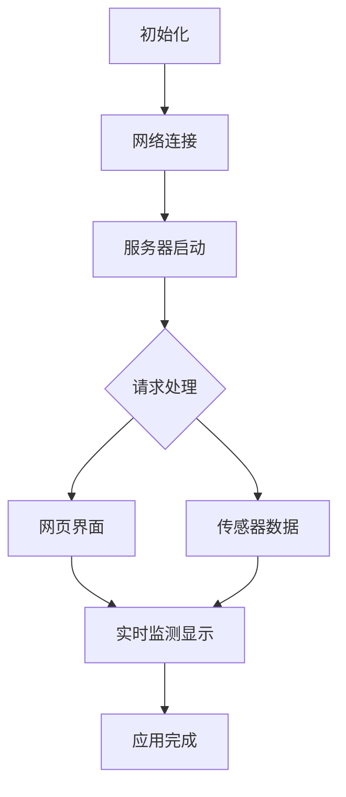

## 14. 网页远程监测空气质量

在智慧校园的建设浪潮中，环境感知与数据互联正成为校园现代化的重要标志。本课程以"网页远程监测空气质量"为主题，带领你深入探索物联网技术在校园环境监测中的创新应用。

现在开始，用技术守护校园空气，用创新构建智慧学习环境，共同探索物联网技术在教育领域的无限可能！


#### 原理

1. 数据采集
   ENS160传感器 → ESP32（通过I2C）
2. 数据传输
   ESP32 → 路由器 → 手机/电脑
3. 数据显示
   浏览器请求 → 服务器响应 → 更新网页


#### 流程图




#### 实验代码

```c++
#include <WiFi.h>
#include <WebServer.h>
#include <Wire.h>
#include <DFRobot_ENS160.h>

// 替换为您的WiFi凭证
const char* ssid = "YourWiFiSSID";
const char* password = "YourWiFiPassword";

WebServer server(80);  // 创建Web服务器对象，端口80
DFRobot_ENS160_I2C ens160(&Wire, 0x53); // 创建ENS160传感器对象

void setup() {
  Serial.begin(115200);

  Wire.begin(); // 初始化I2C总线
  
  // 初始化ENS160传感器
  while(ens160.begin() != 0) {
    Serial.println("ENS160 sensor initialization failed, please check connection!");
    delay(1000);
  }
  Serial.println("ENS160 sensor initialized successfully!");
  
  // 设置工作模式
  ens160.setPWRMode(ENS160_STANDARD_MODE);
  // 设置测量环境数据（温度25°C，湿度50%RH作为默认值）
  ens160.setTempAndHum(25.0, 50.0);

  // 连接WiFi
  WiFi.begin(ssid, password);
  Serial.print("Connecting to WiFi...");
  while (WiFi.status() != WL_CONNECTED) {
    delay(500);
    Serial.print(".");
  }
  Serial.println("");
  Serial.println("WiFi connected");
  Serial.print("IP address: ");
  Serial.println(WiFi.localIP());

  // 设置服务器路由
  server.on("/", handleRoot);       // 根路径
  server.on("/data", handleData);   // 数据API路径

  // 启动服务器
  server.begin();
  Serial.println("HTTP server started");
}

void loop() {
  server.handleClient();  // 处理客户端请求
  
  // 更新传感器数据
  static unsigned long lastUpdate = 0;
  if (millis() - lastUpdate >= 1000) { // 每秒更新一次
    lastUpdate = millis();
  }
}

// 处理根路径请求
void handleRoot() {
  String html = R"=====(
<!DOCTYPE html>
<html>
<head>
  <meta name="viewport" content="width=device-width, initial-scale=1">
  <title>ENS160 Air Quality Sensor</title>
  <style>
    body { font-family: Arial, sans-serif; text-align: center; margin: 0; padding: 20px; background-color: #f5f5f5; }
    .container { max-width: 600px; margin: 0 auto; }
    .sensor-box { 
      background-color: white; 
      border-radius: 10px; 
      padding: 20px; 
      margin: 15px 0; 
      box-shadow: 0 2px 5px rgba(0,0,0,0.1);
    }
    .value { font-size: 28px; font-weight: bold; color: #2c3e50; margin: 10px 0; }
    .unit { font-size: 16px; color: #7f8c8d; }
    .label { font-size: 18px; color: #34495e; margin-bottom: 5px; }
    .updated { font-size: 12px; color: #95a5a6; margin-top: 15px; }
    button { 
      background-color: #3498db; 
      color: white; 
      border: none; 
      padding: 12px 25px; 
      border-radius: 5px; 
      cursor: pointer; 
      font-size: 16px;
      margin-top: 15px;
      transition: background-color 0.3s;
    }
    button:hover { background-color: #2980b9; }
    .aqi-indicator {
      height: 20px;
      border-radius: 10px;
      margin: 10px 0;
      background: linear-gradient(to right, #00e400, #ffff00, #ff7e00, #ff0000, #8f3f97, #7e0023);
    }
    .status {
      padding: 8px;
      border-radius: 5px;
      color: white;
      font-weight: bold;
      margin-top: 5px;
      display: inline-block;
    }
  </style>
</head>
<body>
  <div class="container">
    <h1>ENS160 Air Quality Sensor</h1>
    
    <div class="sensor-box">
      <div class="label">Air Quality Index (AQI)</div>
      <div class="aqi-indicator"></div>
      <div><span id="aqi-value" class="value">--</span></div>
      <div id="aqi-status" class="status">--</div>
      <div class="unit">1-5 (1=Excellent, 5=Unhealthy)</div>
    </div>
    
    <div class="sensor-box">
      <div class="label">TVOC Concentration</div>
      <div><span id="tvoc-value" class="value">--</span> <span class="unit">ppb</span></div>
    </div>
    
    <div class="sensor-box">
      <div class="label">CO2 Equivalent</div>
      <div><span id="eco2-value" class="value">--</span> <span class="unit">ppm</span></div>
    </div>
    
    <div class="updated" id="last-updated">Last update: --</div>
    
    <button onclick="refreshData()">Refresh Data</button>
  </div>

  <script>
    function getAqiStatus(aqi) {
      if (aqi === 1) return {text: "Excellent", color: "#00e400"};
      if (aqi === 2) return {text: "Good", color: "#ffff00"};
      if (aqi === 3) return {text: "Moderate", color: "#ff7e00"};
      if (aqi === 4) return {text: "Poor", color: "#ff0000"};
      if (aqi === 5) return {text: "Unhealthy", color: "#8f3f97"};
      return {text: "Unknown", color: "#7f8c8d"};
    }
    
    function refreshData() {
      fetch('/data')
        .then(response => response.json())
        .then(data => {
          // Update AQI
          document.getElementById('aqi-value').textContent = data.aqi;
          const aqiStatus = getAqiStatus(data.aqi);
          const aqiElement = document.getElementById('aqi-status');
          aqiElement.textContent = aqiStatus.text;
          aqiElement.style.backgroundColor = aqiStatus.color;
          
          // Update TVOC
          document.getElementById('tvoc-value').textContent = data.tvoc;
          
          // Update eCO2
          document.getElementById('eco2-value').textContent = data.eco2;
          
          // Update timestamp
          const now = new Date();
          document.getElementById('last-updated').textContent = 
            `Last update: ${now.toLocaleTimeString()}`;
        })
        .catch(error => console.error('Error fetching data:', error));
    }
    
    // 页面加载时获取数据
    window.onload = refreshData;
    
    // 每5秒自动刷新数据
    setInterval(refreshData, 5000);
  </script>
</body>
</html>
)=====";

  server.send(200, "text/html", html);
}

// 处理数据API请求
void handleData() {
  // 获取ENS160传感器数据
  uint8_t aqi = ens160.getAQI();
  uint16_t tvoc = ens160.getTVOC();
  uint16_t eco2 = ens160.getECO2();
  
  // 创建JSON响应
  String json = "{";
  json += "\"aqi\":" + String(aqi) + ",";
  json += "\"tvoc\":" + String(tvoc) + ",";
  json += "\"eco2\":" + String(eco2);
  json += "}";
  
  server.send(200, "application/json", json);
}
```


#### 代码说明

**注意：此课程涉及HTML、CSS、JS等课外知识， 只做简单介绍。**

**1. 硬件初始化**

```c++
Wire.begin(); // 初始化I2C总线
  
// 初始化ENS160传感器
while(ens160.begin() != 0) {
    Serial.println("ENS160 sensor initialization failed, please check connection!");
    delay(1000);
}
Serial.println("ENS160 sensor initialized successfully!");
```

- 通过I2C协议与传感器通信。若传感器未连接，程序会卡死在检测循环中。

<br>

**2. 网络服务部分**

**WiFi连接**

```c++
WiFi.begin(ssid, password);
  Serial.print("正在连接到WiFi...");
  while (WiFi.status() != WL_CONNECTED) {
    delay(500);
    Serial.print(".");
  }
  Serial.println("");
  Serial.println("WiFi is connected");
  Serial.print("IP: ");
  Serial.println(WiFi.localIP());
```

- 连接成功后串口会打印ESP32的局域网IP

**服务器初始化**

```c++
WebServer server(80);  // 创建端口80的HTTP服务器

// 路由注册
server.on("/", handleRoot);      // 根路径 → 返回HTML页面
server.on("/data", handleData);  // 数据路径 → 返回JSON数据

server.begin();  // 启动服务器
Serial.println("HTTP server started");
```

- `/` ：返回可视化网页HTML
- `/data` ：返回JSON格式的传感器数据

**请求处理循环**

```c++
void loop() {
  server.handleClient();  // 处理传入的客户端请求
}
```

<br>

**3. 数据处理**

**数据API处理函数**

```c++
void handleData() {
  // 1. 传感器数据采集
  uint8_t aqi = ens160.getAQI();     // 空气质量指数
  uint16_t tvoc = ens160.getTVOC();  // 挥发性有机物
  uint16_t eco2 = ens160.getECO2();  // 等效二氧化碳

  // 2. JSON数据构建
  String json = "{";
  json += "\"aqi\":" + String(aqi) + ",";
  json += "\"tvoc\":" + String(tvoc) + ",";
  json += "\"eco2\":" + String(eco2);
  json += "}";

  // 3. HTTP响应发送
  server.send(200, "application/json", json);  // 状态码200，JSON格式
}
```

- 数据处理流程：

  传感器读取 → 数据格式化 → JSON构建 → HTTP响应

<br>

**4. 动态更新**

```javascript
function refreshData() {
  fetch('/data')  // 发起API请求
    .then(response => response.json())  // 解析JSON响应
    .then(data => {
      // DOM更新
      document.getElementById('aqi-value').textContent = data.aqi;
      document.getElementById('tvoc-value').textContent = data.tvoc;
      document.getElementById('eco2-value').textContent = data.eco2;
      
      // 状态可视化更新
      const aqiStatus = getAqiStatus(data.aqi);
      aqiElement.textContent = aqiStatus.text;
      aqiElement.style.backgroundColor = aqiStatus.color;
      
      // 时间戳更新
      document.getElementById('last-updated').textContent = 
        `Last update: ${new Date().toLocaleTimeString()}`;
    })
}

// 定时自动更新
setInterval(refreshData, 5000);  // 每5秒更新一次

// 页面加载立即更新
window.onload = refreshData;

// 手动更新按钮
<button onclick="refreshData()">Refresh Data</button>
```


#### 实验结果

1. 代码上传成功后，打开串口监视器，设置波特率为115200，可以看到打印的IP信息：

   

2. 在手机/电脑的浏览器中输入该IP地址即可访问空气质量监测页面。

   - 自动更新：页面打开时立即获取数据，页面每5秒自动更新数据。

   - 手动更新：点击刷新按钮立即更新，操作后立即显示新数据。
   - 视觉反馈：状态框根据AQI值动态改变颜色，时间戳显示最后更新时间
   
   <span style="color: rgb(200, 70, 100);">注意：确保手机/电脑与ESP32连接到同一个 WiFi 。</span>
   
   


#### 常见问题解决

1. 若串口监视器无任何信息打印，请按下主板的复位键：

   

2. Fi 连接失败，解决办法：

   - 确保代码里的 WiFi 名称和密码已经替换为你的。
   - 确保你的 WiFi 网络是 2.4GHz 的，ESP32不支持 5GHz WiFi。

3. 若输入IP地址无页面，解决办法：

   - 确保IP地址输入正确。
   - 检查手机/电脑是否与ESP32在同一网络。