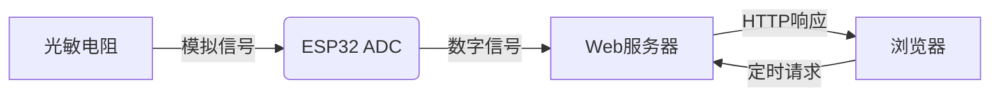

## 15. 网页远程监测光照值

在智慧校园的建设中，环境监测是提升教学环境舒适度、优化能源管理的重要环节。光照强度直接影响学生的学习效率和视觉健康，合理调控教室照明不仅能节能减排，还能创造更适宜的学习环境。

这一课，我们将掌握物联网环境监测的核心技术，实现教室光照强度的实时可视化，为智能照明、节能管理等应用提供基础方案，助力绿色智慧校园建设。

==补手机页面和结构的图==


#### 原理

1. 数据采集

   光敏电阻分压 → ESP32的ADC引脚（模拟转数字）

2. 数据处理

   ESP32 → 路由器 → 手机/电脑

3. 网页交互

   浏览器请求 → 服务器响应 → 返回光照数值并刷新显示


#### 流程图




#### 实验代码

```c++
#include <WiFi.h>
#include <WebServer.h>

// 替换为你的网络凭据
const char* ssid = "YourWiFiSSID";
const char* password = "YourWiFiPassword";

WebServer server(80);

// 光敏电阻连接的引脚
const int lightSensorPin = 34;

// 存储传感器值
int sensorValue = 0;

void setup() {
  Serial.begin(115200);
  
  // 连接WiFi
  WiFi.begin(ssid, password);
  Serial.println("正在连接WiFi...");
  
  while (WiFi.status() != WL_CONNECTED) {
    delay(500);
    Serial.print(".");
  }
  
  Serial.println("");
  Serial.println("WiFi已连接");
  Serial.println("IP地址: ");
  Serial.println(WiFi.localIP());

  // 设置路由
  server.on("/", handleRoot);
  server.on("/readLight", handleLightRead);
  
  // 启动服务器
  server.begin();
  Serial.println("The HTTP server has been started.");
}

void loop() {
  server.handleClient();
}

void handleRoot() {
  String html = R"=====(
<!DOCTYPE html>
<html>
<head>
  <meta name="viewport" content="width=device-width, initial-scale=1">
  <title>ESP32 Photoresistor</title>
  <style>
    body {
      font-family: Arial, sans-serif;
      text-align: center;
      margin: 0;
      padding: 20px;
      background-color: #f5f5f5;
    }
    .container {
      max-width: 600px;
      margin: 0 auto;
      background-color: white;
      padding: 20px;
      border-radius: 10px;
      box-shadow: 0 0 10px rgba(0,0,0,0.1);
    }
    h1 {
      color: #333;
    }
    .sensor-value {
      font-size: 24px;
      margin: 20px 0;
      padding: 10px;
      background-color: #f0f0f0;
      border-radius: 5px;
    }
    button {
      background-color: #4CAF50;
      color: white;
      border: none;
      padding: 10px 20px;
      text-align: center;
      text-decoration: none;
      display: inline-block;
      font-size: 16px;
      margin: 10px 2px;
      cursor: pointer;
      border-radius: 5px;
    }
    button:hover {
      background-color: #45a049;
    }
  </style>
</head>
<body>
  <div class="container">
    <h1>ESP32 Photoresistor</h1>
    <div class="sensor-value" id="sensorValue">--</div>
    <button onclick="readSensor()">read the sensor</button>
    <button onclick="startAutoRead()">automatically refresh</button>
    <button onclick="stopAutoRead()">stop automatically refreshing</button>
  </div>
  
  <script>
    let autoReadInterval;
    
    function readSensor() {
      fetch('/readLight')
        .then(response => response.text())
        .then(data => {
          document.getElementById('sensorValue').innerText = data;
        });
    }
    
    function startAutoRead() {
      stopAutoRead(); // 先停止任何现有的自动刷新
      readSensor();   // 立即读取一次
      autoReadInterval = setInterval(readSensor, 2000); // 每2秒读取一次
    }
    
    function stopAutoRead() {
      if (autoReadInterval) {
        clearInterval(autoReadInterval);
        autoReadInterval = null;
      }
    }
  </script>
</body>
</html>
)=====";

  server.send(200, "text/html", html);
}

void handleLightRead() {
  sensorValue = analogRead(lightSensorPin);
  String valueStr = String(sensorValue);
  server.send(200, "text/plain", valueStr);
  Serial.println("photoresistor value: " + valueStr);
}
```


#### 代码说明

**注意：此课程涉及HTML、CSS、JS等课外知识， 只做简单介绍。**

**1. 初始化阶段**

```c++
#include <WiFi.h>
#include <WebServer.h>
const char* ssid = "YourWiFiSSID";     // WiFi名称
const char* password = "YourWiFiPassword";  // WiFi密码
WebServer server(80);                    // 创建Web服务器（端口80）
const int lightSensorPin = 34;          // 光敏电阻接GPIO34
```

- 引入WiFi和WebServer库，配置网络和硬件引脚。

<br>

**2. 主程序逻辑**

```c++
void setup() {
  // 初始化串口和WiFi连接
  WiFi.begin(ssid, password); 
  
  // 设置两个路由：
  server.on("/", handleRoot);          // 返回HTML页面
  server.on("/readLight", handleLightRead); // 返回传感器数据
  server.begin();                     // 启动服务器
}

void loop() {
  server.handleClient();  // 持续处理客户端请求
}
```

- 启动服务器后，循环处理网页请求。

<br>

**3. 网页交互**

**HTML页面**

```c++
server.on("/", handleRoot);
```

```c++
void handleRoot() {
  String html = R"=====(
<!DOCTYPE html>
...
</body>
</html>
)=====";
```

- HTML网页的代码，页面包含3个按钮：手动读取、自动刷新（2秒）、停止刷新

**动态更新**

```javascript
fetch('/readLight').then(response => response.text())
```

- 通过JavaScript的`fetch()`请求数据

**数据接口**

```c++
server.on("/readLight", handleLightRead);
```

```c++
void handleLightRead() {
  sensorValue = analogRead(lightSensorPin);  // 读取光照值
  String valueStr = String(sensorValue);
  server.send(200, "text/plain", valueStr); // 返回纯文本数据
  Serial.println("photoresistor value: " + valueStr);
}
```

- 当网页请求`/readLight`路径时，ESP32会读取光敏电阻的模拟值，将该数值以纯文本形式返回给网页，同时在串口监视器中打印出当前的光照传感器数值。


#### 实验结果

代码上传成功后，打开串口监视器，设置波特率为115200，可以看到打印的IP信息：


在手机/电脑的浏览器中输入该IP地址即可访问室内光照值监测页面，页面自动刷新每2秒更新数据。

<span style="color: rgb(200, 70, 100);">注意：确保手机/电脑与ESP32连接到同一个 WiFi 。</span>


#### 常见问题解决

1. 若串口监视器无任何信息打印，请按下主板的复位键：

   

2. 若ESP32 一直没有获取到 IP 地址，通常是因为 WiFi 连接失败，解决办法：

   - 确保代码里的 WiFi 名称和密码已经替换为你的。
   - 确保你的 WiFi 网络是 2.4GHz 的，ESP32不支持 5GHz WiFi。

3. 若输入IP地址无页面，解决办法：

   - 确保IP地址输入正确。
   - 检查手机/电脑是否与ESP32在同一网络。

