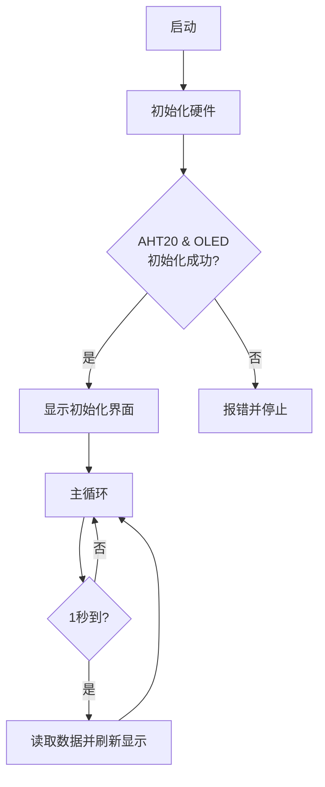

## 3. 智能教室温湿度计

让我们用 AHT20 温湿度传感器和 OLED 屏幕模块，打造一个智能教室温湿度监测系统，实时显示环境数据，为师生创造一个舒适健康的学习环境！


### 3.1 AHT20温湿度传感器

AHT20 基于电容式湿度测量和热敏电阻温度测量原理，能够实时检测环境温湿度，并将数据通过 I²C 接口输出，为环境监测和智能控制提供精准数据支持。


#### 参数

工作电压 ：DC 3.3 ~ 5V 

通讯接口 ：I2C

I2C地址 ：0x38

温度范围 ：-10°C ~ +50°C

湿度范围 ：0% ~ 100% RH

尺寸 ：32 x 23 x 8mm

定位孔大小：直径为 3.2 mm

接口 ：间距2.54 mm，4pin弯针接口


#### 原理

AHT20 基于 **电容式湿度测量** 和 **热敏电阻温度测量** 原理：

- 湿度测量：通过电容式传感器检测空气中的湿度变化，电容值随湿度变化而变化。
- 温度测量：通过热敏电阻检测环境温度，电阻值随温度变化而变化。
- 数字输出：传感器内部集成了 ADC（模数转换器）和校准电路，将模拟信号转换为数字信号，并通过 I²C 接口输出。


#### 实验代码

```c++
#include <Wire.h>
#include <AHT20.h>
AHT20 aht20;

void setup()
{
  Serial.begin(115200);

  Wire.begin(); //Join I2C bus
  //Check if the AHT20 will acknowledge
  if (aht20.begin() == false)
  {
    Serial.println("AHT20 not detected. Please check wiring.");
    while (1);
  }
  Serial.println("AHT20 acknowledged.");
}

void loop()
{
  //Get the new temperature and humidity value
  float temperature = aht20.getTemperature();
  float humidity = aht20.getHumidity();

  //Print the results
  Serial.print("Temperature: ");
  Serial.print(temperature, 2);
  Serial.print(" C\t");
  Serial.print("Humidity: ");
  Serial.print(humidity, 2);
  Serial.print("% RH");

  Serial.println();

  //The AHT20 can respond with a reading every ~50ms. However, increased read time can cause the IC to heat around 1.0C above ambient.
  //The datasheet recommends reading every 2 seconds.
  delay(2000);
}
```


#### 代码说明

**1. 硬件与库配置**

```c++
#include <Wire.h>
#include <AHT20.h>
AHT20 aht20;
```

- 引入 I²C 通信库和 AHT20 传感器库，创建一个 AHT20 对象，命名为 `aht20`，用于操作传感器。

<br>

**2. 初始化设置(setup函数)**

```c++
void setup()
{
  Serial.begin(115200);

  Wire.begin(); //Join I2C bus
  //Check if the AHT20 will acknowledge
  if (aht20.begin() == false)
  {
    Serial.println("AHT20 not detected. Please check wiring. Freezing.");
    while (1);
  }
  Serial.println("AHT20 acknowledged.");
}
```

- 初始化串口通信(115200波特率)

- 初始化I2C总线

- 检测AHT20传感器是否连接正常

  如果检测失败，程序会停止并提示检查接线

  检测成功则显示确认信息

<br>

**3.  主循环(loop函数)**

```c++
aht20.getTemperature()
aht20.getHumidity()
```

- 读取当前温度值，返回浮点数（单位：°C）；
- 读取当前湿度值，返回浮点数（单位：% RH）。

```c++
void loop()
{
  //Get the new temperature and humidity value
  float temperature = aht20.getTemperature();
  float humidity = aht20.getHumidity();

  //Print the results
  Serial.print("Temperature: ");
  Serial.print(temperature, 2);
  Serial.print(" C\t");
  Serial.print("Humidity: ");
  Serial.print(humidity, 2);
  Serial.print("% RH");

  Serial.println();

  //The AHT20 can respond with a reading every ~50ms. However, increased read time can cause the IC to heat around 1.0C above ambient.
  //The datasheet recommends reading every 2 seconds.
  delay(2000);
}
```

- 读取当前温度和湿度数据，返回浮点数。

- 通过串口监视器输出格式化后的数据。

  `Serial.print(temperature, 2);` 中的 `2` 表示数值保留两位小数。

- 延时 2 秒(遵循传感器数据手册推荐的最小读取间隔)。


#### 实验结果

代码上传成功后，打开串口监视器（波特率设置为 115200），每 2 秒更新一次温度和湿度数据。


---


### 3.2 1.3寸  IIC  OLED屏 

OLED 屏是一种自发光显示DS技术，具有高对比度、广视角和低功耗等特点，能够显示清晰的图像和文字，广泛应用于智能设备、可穿戴设备和工业控制等领域。

==图==


#### 参数

工作电压 ：DC 3.3 ~ 5V 

驱动芯片 ：SH1106 

通讯接口 ：I2C

分辨率 ：128*64

尺寸 ：37 x 34 x 6mm

定位孔大小：30.5mm(长) 29mm（宽）

接口 ：间距2.54 mm，4pin弯针接口


#### 原理

**OLED 屏的工作原理**

- **自发光**：OLED 屏的每个像素由有机发光材料组成，当电流通过时，像素会发光，无需背光。
- **像素控制**：通过控制每个像素的电流，可以调节其亮度，从而实现图像的显示。
- **驱动芯片**：内置驱动芯片 SH1106，负责接收控制信号并驱动像素。

**OLED 屏的控制原理**

OLED 屏的控制原理基于 **显存（GRAM）** 和 **通信协议**：

- **显存（GRAM）**：
  - OLED 屏内置显存，用于存储当前显示的图像数据。
  - 通过向显存写入数据，可以更新屏幕内容。
- **通信协议**：
  - 通过 I²C 接口发送命令和数据，控制 OLED 屏的工作模式和显存内容。
  - 常用命令包括初始化、清屏、设置光标位置、写入数据等。


#### 实验代码

```c++
#include <Wire.h>
#include <Adafruit_GFX.h>
#include <Adafruit_SH110X.h>

// OLED配置
#define SCREEN_WIDTH 128
#define SCREEN_HEIGHT 64
#define OLED_RESET -1  // 共用I2C复位
#define I2C_ADDRESS 0x3C  // SH1106默认地址

// 创建显示对象
Adafruit_SH1106G display(SCREEN_WIDTH, SCREEN_HEIGHT, &Wire, OLED_RESET);

void setup() {
  // 初始化串口
  Serial.begin(115200);
  
  // 初始化OLED
  if(!display.begin(I2C_ADDRESS, true)) {  // true表示128x64分辨率
    Serial.println("SH1106初始化失败");
    while(1);  // 卡住不再继续
  }
  
  // 清屏并设置文本属性
  display.clearDisplay();
  display.setTextSize(1);      // 文本大小
  display.setTextColor(SH110X_WHITE);  // 单色显示
  display.setCursor(10, 25);   // 设置起始位置(居中)
  
  // 显示"Hello world!"
  display.println("Hello world!");
  
  // 更新显示
  display.display();
}

void loop() {
  // 不需要循环内容
  delay(1000);
}
```


#### 代码说明

**1. 硬件与库配置**

**头文件引入**

```c++
#include <Wire.h>               // I2C通信库
#include <Adafruit_GFX.h>      // Adafruit图形核心库
#include <Adafruit_SH110X.h>   // SH1106专用驱动库
```

**OLED参数配置**

```c++
#define SCREEN_WIDTH 128       // 屏幕宽度(像素)
#define SCREEN_HEIGHT 64       // 屏幕高度(像素)
#define OLED_RESET -1          // 复位引脚(-1表示共用I2C复位)
#define I2C_ADDRESS 0x3C       // I2C设备地址(7位地址)
```

**创建显示对象**

```c++
Adafruit_SH1106G display(SCREEN_WIDTH, SCREEN_HEIGHT, &Wire, OLED_RESET);
```

<br>

**2. 初始化设置(setup函数)**

```c++
void setup() {
  // 初始化串口
  Serial.begin(115200);
  
  // 初始化OLED
  if(!display.begin(I2C_ADDRESS, true)) {  // true表示128x64分辨率
    Serial.println("SH1106初始化失败");
    while(1);  // 卡住不再继续
  }
  
  // 清屏并设置文本属性
  display.clearDisplay();
  display.setTextSize(1);      // 文本大小
  display.setTextColor(SH110X_WHITE);  // 单色显示
  display.setCursor(10, 25);   // 设置起始位置(居中)
  
  // 显示"Hello world!"
  display.println("Hello world!");
  
  // 更新显示
  display.display();
}
```

- 初始化串口通信
- 初始化OLED显示屏
- 配置显示参数
- 输出"Hello world!"文本
- 更新显示内容

<br>

**3.  主循环(loop函数)**

```c++
delay(1000);
```

- `delay(1000)`使程序暂停执行1秒，防止程序过于频繁地空转


#### 实验结果

代码上传成功后，在 OLED 屏幕中间可以看到打印的“Hello world!”：

==图==

每 1000 毫秒刷新一次显示内容。


#### 常见问题解决

1. 代码上传不成功？
   - 确保库文件添加
   - 确保IIC接线正确

---


### 3.3 智能教室温湿度计

在前期的学习中，我们已经熟悉了 OLED显示屏 的文字显示技术，并掌握了 AHT20高精度温湿度传感器 的数据采集方法。现在，让我们将这两项技术深度融合，打造一个智能教室温湿度计！

通过本课程，我们将构建一个能实时追踪教室 温度 和 相对湿度 的智能监测站。系统会通过OLED屏幕清晰显示：

- 实时温度数值（℃）
- 当前湿度百分比（%）

现在，让我们开始这场环境感知技术的实践之旅吧！


#### 流程图




#### 实验代码

```c++
#include <Wire.h>
#include <AHT20.h>
#include <Adafruit_GFX.h>
#include <Adafruit_SH110X.h>

// OLED配置
#define SCREEN_WIDTH 128
#define SCREEN_HEIGHT 64
#define OLED_RESET -1
#define I2C_ADDRESS 0x3C

Adafruit_SH1106G display(SCREEN_WIDTH, SCREEN_HEIGHT, &Wire, OLED_RESET);
AHT20 aht20;

// 上次更新时间
unsigned long lastUpdate = 0; // 记录上次更新时间
const unsigned long updateInterval = 2000; // 2秒更新间隔

void setup() {
  Serial.begin(115200);
  
  Wire.begin();
  
  // 初始化AHT20传感器
  if(!aht20.begin()) {
    Serial.println("AHT20未检测到! 请检查接线");
    while(1); // 仅通过串口报错
  }

  // 初始化OLED
  if(!display.begin(I2C_ADDRESS, true)) {
    Serial.println("OLED初始化失败");
    while(1); // 仅通过串口报错
  }

  // 清屏显示初始信息
  display.clearDisplay();
  display.setTextSize(1);
  display.setTextColor(SH110X_WHITE);
  display.setCursor(10, 30);
  display.println("Initializing...");
  display.display();
  delay(1000);
}

void loop() {
  if(millis() - lastUpdate >= updateInterval) {
    lastUpdate = millis();
    
    float temperature = aht20.getTemperature();
    float humidity = aht20.getHumidity();
    
    // 精简的显示更新
    display.clearDisplay();
    display.setTextSize(1);

    // 绘制标题栏
    display.setTextSize(1);
    display.setCursor(0, 0);
    display.println("Hygrothermograph");
    display.drawLine(0, 10, SCREEN_WIDTH, 10, SH110X_WHITE);
    
    // 温度显示（优化符号显示）
    display.setCursor(0, 25);
    display.print("T: ");
    display.print(temperature, 1);
    display.cp437(true);
    display.write(248); // °符号
    display.println("C");
    
    // 湿度显示
    display.setCursor(0, 45);
    display.print("RH: ");
    display.print(humidity, 1);
    display.println("%");
    
    display.display();
  }
}
```


#### 代码说明

**1. 硬件配置与定时控制模块**

**硬件初始化**

```c++
#include <Wire.h>
#include <AHT20.h>
#include <Adafruit_GFX.h>
#include <Adafruit_SH110X.h>

// OLED配置
#define SCREEN_WIDTH 128
#define SCREEN_HEIGHT 64
#define OLED_RESET -1
#define I2C_ADDRESS 0x3C

Adafruit_SH1106G display(SCREEN_WIDTH, SCREEN_HEIGHT, &Wire, OLED_RESET);
AHT20 aht20;
```

**定时控制变量**

```c++
unsigned long lastUpdate = 0; // 记录上次更新时间
const unsigned long updateInterval = 2000; // 2秒更新间隔
```

2秒更新间隔，遵循传感器数据手册推荐的最小读取间隔

<br>

**2. 初始化设置(setup函数)**

```c++
void setup() {
  Serial.begin(115200);
    
  Wire.begin();
  
  // 初始化AHT20传感器
  if(!aht20.begin()) {
    Serial.println("AHT20未检测到! 请检查接线");
    while(1); // 仅通过串口报错
  }

  // 初始化OLED
  if(!display.begin(I2C_ADDRESS, true)) {
    Serial.println("OLED初始化失败");
    while(1); // 仅通过串口报错
  }

  // 清屏显示初始信息
  display.clearDisplay();
  display.setTextSize(1);
  display.setTextColor(SH110X_WHITE);
  display.setCursor(10, 30);
  display.println("Initializing...");
  display.display();
  delay(1000);
}
```

- 完成所有硬件初始化

- 在 OLED 上显示启动信息 "Initializing..."

  `display.println()` 操作只修改内存中的图像数据，调用 `display()` 后才会实际更新显示

<br>

**3.  主循环(loop函数)**

**定时控制**

```c++
if(millis() - lastUpdate >= updateInterval) {
  lastUpdate = millis();
  // ...后续代码
}
```

实现非阻塞式定时采样

- 每 `updateInterval`（1000ms）执行一次数据更新
- 通过 `millis()` 计时，避免 `delay()` 造成的程序阻塞
- `lastUpdate` 记录最后一次更新时间戳

**传感器数据采集**

```c++
float temperature = aht20.getTemperature(); // 获取温度（单位℃）
float humidity = aht20.getHumidity();     // 获取湿度（单位%RH）
```

**OLED显示更新**

```c++
// 精简的显示更新
display.clearDisplay();
display.setTextSize(1);

// 绘制标题栏
display.setTextSize(1);
display.setCursor(0, 0);
display.println("Hygrothermograph");
display.drawLine(0, 10, SCREEN_WIDTH, 10, SH110X_WHITE);

// 温度显示（优化符号显示）
display.setCursor(0, 25);
display.print("T: ");
display.print(temperature, 1);
display.cp437(true);
display.write(248); // °符号
display.println("C");

// 湿度显示
display.setCursor(0, 45);
display.print("RH: ");
display.print(humidity, 1);
display.println("%");

display.display();
```

- 屏幕初始化

- 标题栏绘制

- 温湿度显示

- 屏幕刷新

#### 实验结果

代码上传成功后，AHT20传感器每2秒读取一次温湿度数值，并显示在OLED屏上。

==图==
