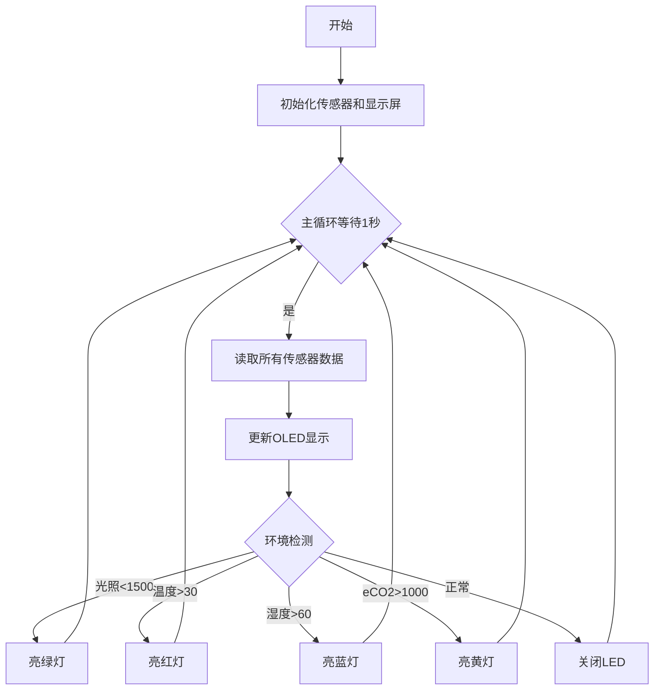

## 4. 教室环境监测显示与报警

### 4.1 教室环境监测显示与报警

在前面的学习中，我们已经掌握了光敏传感器、ENS160空气质量传感器、6812 RGB灯模块和OLED显示屏的使用方法。现在，我们将整合这些技术，开发一个智能教室环境监测系统！

项目功能：

- 实时监测：通过OLED屏显示光照、温湿度、空气质量（eCO₂）
- 智能报警：当参数异常时，RGB灯自动切换颜色提示：
  - 光照异常 → 绿色
  - 温度升高 → 红色
  - 湿度超标 → 蓝色
  - eCO₂浓度过高 → 黄色

这个系统不仅能直观展示教室环境状况，还能通过色彩设计视觉报警，帮助师生快速识别环境问题。现在，让我们开始构建这个集监测、显示与智能报警于一体的装置吧！


#### 流程图




#### 实验代码

```c++
#include <Wire.h>
#include <AHT20.h>
#include <Adafruit_GFX.h>
#include <Adafruit_SH110X.h>
#include <DFRobot_ENS160.h>
#include <Adafruit_NeoPixel.h>

// 硬件配置
#define SCREEN_WIDTH 128
#define SCREEN_HEIGHT 64
#define OLED_RESET -1
#define I2C_ADDRESS 0x3C
#define LED_PIN     4       // RGB灯控制引脚
#define LED_COUNT   4       // LED灯珠数量
#define I2C_ADDR    0x53    // ENS160默认I2C地址

// eCO2浓度等级阈值 (ppm)
#define ECO2_MODERATE   1000
#define ECO2_POOR       1500

// 创建对象
AHT20 aht20;
DFRobot_ENS160_I2C ENS160(&Wire, I2C_ADDR);
Adafruit_NeoPixel leds(LED_COUNT, LED_PIN, NEO_GRB + NEO_KHZ800);
Adafruit_SH1106G display(SCREEN_WIDTH, SCREEN_HEIGHT, &Wire, OLED_RESET);

// 上次更新时间
unsigned long lastUpdate = 0;
const unsigned long updateInterval = 2000; // 2秒更新间隔

const int lightSensorPin = 34; // 光敏电阻传感器


void setup() {
  Serial.begin(115200);
  
  Wire.begin();
  
  // 初始化AHT20传感器
  if(!aht20.begin()) {
    Serial.println("AHT20未检测到! 请检查接线");
    while(1); // 仅通过串口报错
  }

  // 初始化OLED
  if(!display.begin(I2C_ADDRESS, true)) {
    Serial.println("OLED初始化失败");
    while(1); // 仅通过串口报错
  }

  // 初始化ENS160
  while (NO_ERR != ENS160.begin()) {
    Serial.println("ENS160初始化失败,请检查接线!");
    delay(3000); // 仅通过串口报错
  }
  
  // 设置传感器模式
  ENS160.setPWRMode(ENS160_STANDARD_MODE);
  ENS160.setTempAndHum(25.0, 50.0);  // 设置校准温湿度

  // 初始化RGB灯带
  leds.begin();
  leds.show();  // 初始清空灯带
  leds.setBrightness(100);  // 中等亮度
}

void loop() {
  if(millis() - lastUpdate >= updateInterval) {
    lastUpdate = millis();
    
    float temperature = aht20.getTemperature();
    float humidity = aht20.getHumidity();

    int illum = analogRead(lightSensorPin); // 光照值

    // 获取eCO2浓度
    uint16_t eco2 = ENS160.getECO2();
    Serial.print("eCO2 concentration: ");
    Serial.print(eco2);
    Serial.println(" ppm");
    
    // 显示更新
    display.clearDisplay();
    display.setTextSize(1);
    
    // 更新显示
    updateDisplay(temperature, humidity, illum, eco2);

    if(illum < 1500){
      setAllLEDs(0, 255, 0);
    }
    else{
      setAllLEDs(0, 0, 0);
    }

    if(temperature > 30){
      setAllLEDs(255, 0, 0);
    }
    else{
      setAllLEDs(0, 0, 0);
    }

    if(humidity > 60){
      setAllLEDs(0, 0, 255);
    }
    else{
      setAllLEDs(0, 0, 0);
    }

    if(eco2 > 1000){
      setAllLEDs(255, 255, 0);
    }
    else{
      setAllLEDs(0, 0, 0);
    }
  }
}

// 数值显示
void updateDisplay(float temp, float humi, float illum, float eco2) {
  // 温度显示
  display.setCursor(0, 12);
  display.print("T: ");
  display.print(temp, 1);
  display.cp437(true);
  display.write(248); // °符号
  display.println("C");
  
  // 湿度显示
  display.setCursor(0, 24);
  display.print("RH: ");
  display.print(humi, 1);
  display.println("%");

  // 空气质量显示
  display.setCursor(0, 36);
  display.print("eco2: ");
  display.print(eco2, 1);
  display.println(" ppm");

  // 光照值显示
  display.setCursor(0, 48);
  display.print("E: ");
  display.print(illum, 1);
  display.println(" Lux");
  
  display.display();
}

// 设置所有LED颜色
void setAllLEDs(uint8_t r, uint8_t g, uint8_t b) {
  for (int i = 0; i < LED_COUNT; i++) {
    leds.setPixelColor(i, leds.Color(r, g, b));
  }
  leds.show();
}
```


#### 代码说明

**1. 硬件配置与库引入**

**引入库**

```c++
#include <Wire.h>               // I2C通信
#include <AHT20.h>              // AHT20温湿度传感器
#include <Adafruit_GFX.h>       // OLED图形库
#include <Adafruit_SH110X.h>    // SH1106 OLED驱动
#include <DFRobot_ENS160.h>     // ENS160空气质量传感器
#include <Adafruit_NeoPixel.h>  // RGB LED控制（如WS2812）
```

**硬件参数定义**

```c++
#define SCREEN_WIDTH 128       // OLED宽度
#define SCREEN_HEIGHT 64       // OLED高度
#define OLED_RESET -1          // OLED复位引脚（未使用）
#define I2C_ADDRESS 0x3C       // OLED的I2C地址
#define LED_PIN 4              // RGB LED控制引脚
#define LED_COUNT 4            // LED灯珠数量
#define I2C_ADDR 0x53          // ENS160的I2C地址

// eCO2浓度阈值（ppm）
#define ECO2_MODERATE 1000     // 中等污染
#define ECO2_POOR 1500         // 严重污染
```

**对象初始化**

```c++
AHT20 aht20;                          // 温湿度传感器
DFRobot_ENS160_I2C ENS160(&Wire, I2C_ADDR);  // 空气质量传感器
Adafruit_NeoPixel leds(LED_COUNT, LED_PIN, NEO_GRB + NEO_KHZ800);  // RGB LED
Adafruit_SH1106G display(SCREEN_WIDTH, SCREEN_HEIGHT, &Wire, OLED_RESET);  // OLED
```

<br>

**2. 初始化设置(setup函数)**

```c++
void setup() {
  Serial.begin(115200);  // 串口初始化（调试用）
  Wire.begin();          // I2C初始化

  // 初始化AHT20温湿度传感器
  if (!aht20.begin()) {
    Serial.println("AHT20未检测到! 请检查接线");
    while (1);  // 卡死，防止继续运行
  }

  // 初始化OLED
  if (!display.begin(I2C_ADDRESS, true)) {
    Serial.println("OLED初始化失败");
    while (1);
  }

  // 初始化ENS160空气质量传感器
  while (NO_ERR != ENS160.begin()) {
    Serial.println("ENS160初始化失败,请检查接线!");
    delay(3000);
  }

  // 设置ENS160工作模式
  ENS160.setPWRMode(ENS160_STANDARD_MODE);  // 标准模式（平衡功耗和精度）
  ENS160.setTempAndHum(25.0, 50.0);         // 校准温湿度（初始值）

  // 初始化RGB LED
  leds.begin();          // 启动LED控制
  leds.show();           // 清空LED（初始全灭）
  leds.setBrightness(100);  // 设置亮度（0-255）
}
```

- AHT20 初始化

- OLED 初始化

- ENS160 初始化

- RGB LED 初始化：初始全灭，设置中等亮度

<br>

**3. 主循环(loop函数)**

```c++
void loop() {
  if(millis() - lastUpdate >= updateInterval) {
    lastUpdate = millis();
    
    float temperature = aht20.getTemperature();
    float humidity = aht20.getHumidity();

    int illum = analogRead(lightSensorPin); // 光照值

    // 获取eCO2浓度
    uint16_t eco2 = ENS160.getECO2();
    Serial.print("eCO2 concentration: ");
    Serial.print(eco2);
    Serial.println(" ppm");
    
    // 显示更新
    display.clearDisplay();
    display.setTextSize(1);
    
    // 更新显示
    updateDisplay(temperature, humidity, illum, eco2);

    if(illum < 1500){
      setAllLEDs(0, 255, 0);
    }
    else{
      setAllLEDs(0, 0, 0);
    }

    if(temperature > 30){
      setAllLEDs(255, 0, 0);
    }
    else{
      setAllLEDs(0, 0, 0);
    }

    if(humidity > 60){
      setAllLEDs(0, 0, 255);
    }
    else{
      setAllLEDs(0, 0, 0);
    }

    if(eco2 > 1000){
      setAllLEDs(255, 255, 0);
    }
    else{
      setAllLEDs(0, 0, 0);
    }
  }
}
```

 - 定时更新：每 2 秒 读取一次传感器数据
 - 传感器数据读取：
   - `aht20.getTemperature()` → 温度（℃）
   - `aht20.getHumidity()` → 湿度（%）
   - `analogRead(lightSensorPin)` → 光照强度
   - `ENS160.getECO2()` → eCO2（ppm）
 - OLED 显示更新：清屏，然后显示温湿度、光照、eCO2
 - RGB LED 状态反馈：
   - 低光照（<1500）→ 亮绿灯（`0,255,0`）
   - 高温（>30℃）→ 亮红灯（`255,0,0`）
   - 高湿（>60%）→ 亮蓝灯（`0,0,255`）
   - 高eCO2（>1000ppm）→ 亮黄灯（`255,255,0`）

<br>

**4. 核心功能函数**

**OLED 数据显示**

```c++
void updateDisplay(float temp, float humi, float illum, float eco2) {
  // 温度显示（带°C符号）
  display.setCursor(0, 12);
  display.print("T: ");
  display.print(temp, 1);
  display.cp437(true);
  display.write(248);  // °符号
  display.println("C");

  // 湿度显示（带%）
  display.setCursor(0, 24);
  display.print("RH: ");
  display.print(humi, 1);
  display.println("%");

  // eCO2显示（ppm）
  display.setCursor(0, 36);
  display.print("eco2: ");
  display.print(eco2, 1);
  display.println(" ppm");

  // 光照显示（Lux）
  display.setCursor(0, 48);
  display.print("E: ");
  display.print(illum, 1);
  display.println(" Lux");

  display.display();  // 刷新屏幕
}
```

**设置所有LED颜色**

```c++
void setAllLEDs(uint8_t r, uint8_t g, uint8_t b) {
  for (int i = 0; i < LED_COUNT; i++) {
    leds.setPixelColor(i, leds.Color(r, g, b));  // 设置每个LED颜色
  }
  leds.show();  // 更新LED显示
}
```


#### 实验结果

代码上传成功后，通过AHT20传感器、ENS160传感器和光敏电阻传感器实时采集环境数据并每2秒更新在 OLED 显示屏 ，同时用 RGB LED 提供视觉反馈。

- 低光照（<1500）→ 亮绿灯
- 高温（>30℃）→ 亮红灯
- 高湿（>60%）→ 亮蓝灯
- 高eCO2（>1000ppm）→ 亮黄灯

==动图==
