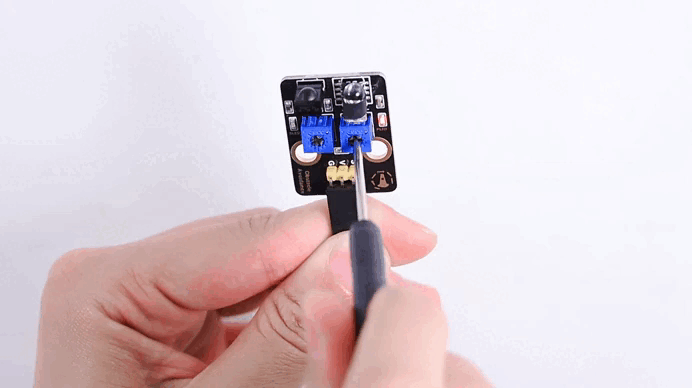
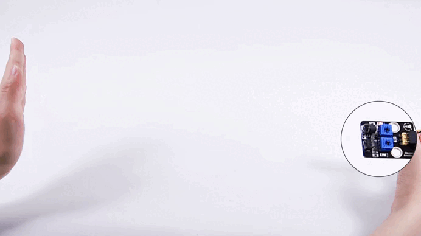
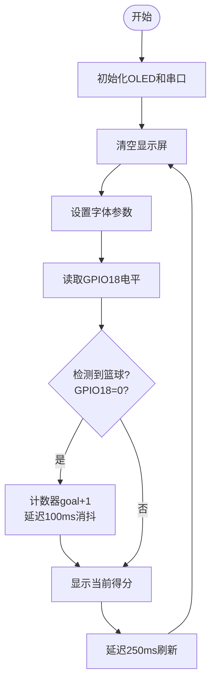

## 6. 智能篮球计分器

让我们用红外避障传感器和 OLED 屏打造一个智能篮球计分器，通过精准检测进球并实时显示比分，体验科技与体育的完美结合！

### 6.1 红外避障传感器

这款红外避障传感器是一种基于红外原理的检测设备，能够实时感知前方障碍物的距离，广泛应用于机器人、智能小车和自动避障系统中。


#### 参数

工作电压 : DC 5V 

电流 : 50 mA

最大功率 : 0.3 W

工作温度 ：-10°C ~ +50°C

输出信号 : 数字信号

感应距离 : 2 ~ 40 cm

尺寸 ：32 x 23 x 12mm

定位孔大小 ：直径为 4.8 mm

接口 ：间距2.54 mm，3pin弯针接口


#### 原理


**工作原理：**

1. 发射红外光：
   - 红外发射管发射一束红外光。
2. 接收反射光：
   - 如果前方有障碍物，红外光会被反射回来，被红外接收头接收。
3. 信号处理：
   - 传感器内部的电路根据接收到的反射光强度判断障碍物的距离。
   - 输出信号为数字信号（高电平或低电平）。

红外避障传感器受环境光干扰较大，检测距离较短（通常为 2cm ~ 30cm）。

**调节传感器灵敏度：**

调节红外避障模块上的电位器可以改变传感器的灵敏度和检测距离。以下是调节步骤和注意事项，帮助您将检测距离调整到**最大**。

<span style="color: rgb(200, 70, 100);">注意：调节时保持传感器探头前方**远离障碍物**或**没有障碍物**阻挡。</span>

首先，将两个电位器调到中间位置（默认状态）。

先调节发射功率，将电位器顺时针到尽头，然后逆时针慢慢往回调，微调使传感器上SLED灯介于刚刚亮与不亮之间的<span style="color: rgb(10, 10, 200);">不亮</span>状态。


接着设置接收频率，同样将电位器顺时针到尽头，然后逆时针慢慢往回调，微调使传感器上SLED灯介于刚刚亮与不亮之间的<span style="color: rgb(10, 10, 200);">不亮</span>状态，此时能检测障碍物的距离最长。



调节完毕，可以开始使用了。用手测试，能看到SLED灯亮起。




#### 实验代码

```c++
int val = 0;
void setup() {
  Serial.begin(115200);   
  pinMode(18, INPUT);    
}

void loop() {
  val = digitalRead(18);  //读取数字电平
  Serial.print(val);     //打印读取的电平信号
  if (val == 0) {  //障碍物检测
    Serial.println("\t There are obstacles");
    delay(100);
  }
  else {  //未发现障碍物
    Serial.println("\t All going well");
    delay(100);
  }
}
```


#### 代码说明

- 读取红外避障模块的输出信号。

  - `0`：检测到障碍物。

  - `1`：未检测到障碍物。

- 根据信号判断是否有障碍物：

  - 如果检测到障碍物，输出 `There are obstacles`。
  - 如果未检测到障碍物，输出 `All going well`。

- 通过串口监视器实时显示检测结果。


#### 实验结果

打开串口监视器，波特率设置为 115200：

- 当未检测到障碍物时，输出 `1` 和 `All going well`。
- 当检测到障碍物时，输出 `0` 和 `There are obstacles`。


---


### 6.2 智能篮球计分器

在前面的课程中，我们已经学习了红外避障传感器和 OLED 屏的基本原理与使用方法。现在，让我们将这些知识结合起来，动手制作一个智能篮球计分器！通过这个项目，我们将实现一个能够精准检测进球并实时显示比分的智能系统，既提升比赛体验，又充满科技感。

接下来，我们将一步步完成硬件连接、代码编写和功能调试，最终打造出一个实用的智能篮球计分器。让我们一起开启这段充满创意与挑战的旅程吧！


#### 流程图




#### 实验代码

```c++
#include <Wire.h>
#include <Adafruit_GFX.h>
#include <Adafruit_SH110X.h>

#define SCREEN_WIDTH 128
#define SCREEN_HEIGHT 64
#define OLED_RESET -1  // 共用I2C复位
#define I2C_ADDRESS 0x3C  // SH1106默认地址

// 创建显示对象
Adafruit_SH1106G display(SCREEN_WIDTH, SCREEN_HEIGHT, &Wire, OLED_RESET);

const int sensorPin = 18;
volatile int goalCount = 0;  // 使用volatile保证中断安全
unsigned long lastDetectTime = 0;
const int debounceTime = 50; // 消抖时间(ms)

void setup() {
  Serial.begin(115200);

  // 初始化OLED
  if(!display.begin(I2C_ADDRESS, true)) {  // true表示128x64分辨率
    Serial.println("SH1106初始化失败");
    while(1);  // 卡住不再继续
  }

  // 清屏并设置文本属性
  display.clearDisplay();
  display.setTextSize(3);      // 文本大小
  display.setTextColor(SH110X_WHITE);
  
  pinMode(sensorPin, INPUT);
  attachInterrupt(digitalPinToInterrupt(sensorPin), detectCallback, FALLING);
}

void detectCallback() {
  if (millis() - lastDetectTime > debounceTime) {
    goalCount++;
    lastDetectTime = millis();
  }
}

void loop() {
  // 显示
  display.clearDisplay();
  display.setCursor(40, 20);  
  display.println(goalCount);
  display.display();
}
```


#### 代码说明

**1. 头文件、常量与变量定义**

```c++
#include <Wire.h>                // I2C通信库
#include <Adafruit_GFX.h>        // Adafruit图形库
#include <Adafruit_SH110X.h>     // SH1106 OLED驱动库

#define SCREEN_WIDTH 128         // OLED宽度(像素)
#define SCREEN_HEIGHT 64         // OLED高度(像素)
#define OLED_RESET -1            // 共用I2C复位(无硬件复位)
#define I2C_ADDRESS 0x3C         // SH1106默认I2C地址

Adafruit_SH1106G display(SCREEN_WIDTH, SCREEN_HEIGHT, &Wire, OLED_RESET); // OLED显示对象

const int sensorPin = 18;        // 红外传感器连接引脚
volatile int goalCount = 0;      // 中断安全的计数器变量
unsigned long lastDetectTime = 0; // 上次检测时间(用于消抖)
const int debounceTime = 50;     // 消抖时间(毫秒)
```

- OLED相关：定义了屏幕尺寸、I2C地址，并创建了显示对象。
- 传感器相关：指定红外传感器引脚，并设置计数器变量（`volatile`确保中断安全）。
- 消抖处理：通过`lastDetectTime`和`debounceTime`防止信号抖动导致的误触发。

<br>

**2. 初始化设置(setup函数)**

```c++
void setup() {
  Serial.begin(115200);  // 初始化串口(调试用)

  // 初始化OLED
  if(!display.begin(I2C_ADDRESS, true)) {  // true表示128x64分辨率
    Serial.println("SH1106初始化失败");
    while(1);  // 初始化失败时卡住
  }

  // 清屏并设置文本属性
  display.clearDisplay();
  display.setTextSize(3);       // 大号字体
  display.setTextColor(SH110X_WHITE); // 白色文本
  
  // 配置红外传感器
  pinMode(sensorPin, INPUT);
  attachInterrupt(digitalPinToInterrupt(sensorPin), detectCallback, FALLING);
}
```

- OLED初始化。

- 显示设置：清屏、设置大号白色字体（适合显示数字）。

- 传感器配置：

  通过`attachInterrupt`设置下降沿触发中断（检测到物体时执行`detectCallback`）。

<br>

**3. 中断回调函数**

```c++
void detectCallback() {
  if (millis() - lastDetectTime > debounceTime) {
    goalCount++;
    lastDetectTime = millis();
  }
}
```

`millis()` 是 Arduino 编程中非常重要的一个时间函数，它的作用是**返回从程序开始运行到现在所经过的毫秒数**。

1. 当传感器检测到物体时，产生下降沿信号（电平1→0）,触发`detectCallback()`中断服务函数
2. 通过**时间差消抖**（50ms间隔）：
   - 如果两次触发间隔 > 50ms → 视为有效触发，`goalCount++`
   - 否则视为抖动噪声，忽略此次触发
3. 更新最后有效触发时间戳`lastDetectTime`


<br>

**4. 主循环(loop函数)**

```c++
void loop() {
  // OLED显示计数
  display.clearDisplay();
  display.setCursor(40, 20);  // 居中显示
  display.println(goalCount);
  display.display();          // 刷新屏幕
}
```

- OLED显示：清屏后显示当前计数。


#### 实验结果

代码上传成功后，我们将篮球投入篮筐，进球时：

- 分数加 1。

- OLED 屏幕实时显示当前得分。

**注意：**红外避障传感器对环境光敏感，尽量在光线稳定的环境中使用。


---

