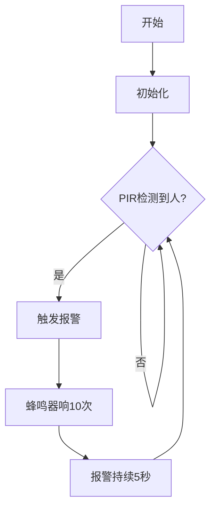

## 8. 校园入侵警报系统

这节课我们要制作一个校园入侵警报系统，当有人偷偷翻墙进校园时，红外传感器会立刻发现它，并让蜂鸣器发出警报声，就像一个小小电子保安！

### 8.1 人体红外热释传感器

人体红外热释传感器（PIR传感器）是一种用于检测人体或动物发出的红外信号，从而感知其运动或存在的电子器件。


#### 参数

工作电压 : DC 3.3 ~ 5V 

工作电流 : 50 mA

最大功率 : 0.3 W

静态电流 : <50 uA

工作温度 ：-10°C ~ +50°C

控制信号 : 数字信号

触发方式 : L 不可重复触发/H 重复触发

最大检测距离 : 7米

感应角度 : <100 度锥角

尺寸 ：32 x 23 x 8mm

定位孔大小：直径为 4.8 mm

接口 ：间距为2.54 mm，3pin弯针接口


#### 原理

**1. 热释电效应**：
PIR传感器核心是一种**热释电材料**（如钽酸锂），当接收到人体或动物发出的**红外辐射（波长约8-14μm）**时，会产生微弱的电荷变化，经内部电路放大后输出电信号。

**2. 菲涅尔透镜增强检测**：
传感器前方通常配有**菲涅尔透镜**，能将大范围内的红外信号聚焦到传感器上，同时分割成多个探测区，当目标移动时，传感器因温度变化触发信号。

**3. 信号处理**：
传感器内部比较器会过滤环境噪声（如阳光、暖气干扰），仅对符合人体特征的红外**变化**输出**高低电平信号**。

PIR传感器输出瞬态高电平（有人**移动**时触发，持续几秒后恢复低电平）。

- 检测到有人移动时输出高电平，模块上的LED熄灭
- 反之输出低电平，模块上的LED点亮


#### 实验代码

```c++
/*  
 * 名称    : 8_1
 * 功能    : PIR传感器检测人体移动
 * IDE版本 ：ARDUINO 2.3.4
 * 作者    : https://www.keyestudio.com/
 */
int val = 0;
int PIRPin = 25;   //PIR传感器的引脚定义为GPIO25
void setup() {
  Serial.begin(115200);   //波特率设置为115200
  pinMode(PIRPin, INPUT);    //将传感器设置为输入模式
}

void loop() {
  val = digitalRead(PIRPin);    //读取传感器值
  Serial.print(val);    //打印传感器值
  if (val == 1) {    //附近有人移动，输出高电平
    Serial.println("\t Some body is in this area!");
    delay(100);
  }
  else {    //如果附近没有人移动，输出低电平
    Serial.println("\t No one!");
    delay(100);
  }
}
```


#### 代码说明

- 读取PIR传感器的输出信号。

  - `0`：有人移动

  - `1`：无人移动

- 根据信号判断是否有人移动：

  - 如果检测到有人移动，输出 `Some body is in this area!`。
  - 如果未检测到有人移动，输出 `No one!`。

- 通过串口监视器实时显示检测结果。


#### 实验结果

代码上传成功后，实时检测是否有人移动。

我们可以挥动手掌模仿有人经过。PIR传感器对**温度变化**敏感，只要手掌在探测区域内移动（即使缓慢），即可被检测到。

- 手掌静止，输出`0`和提示
- 挥动手掌，输出`1`和提示

==动图==


---


### 8.2 无源蜂鸣器

无源蜂鸣器是一种需要外部PWM信号驱动才能发声的电子元件，其音调由输入方波的频率决定。


#### 参数

工作电压 ：DC 3.3 ~ 5V 

工作温度 ：-10°C ~ +50°C

控制信号 ：数字信号

尺寸 ：32 x 23 x 12 mm（不带壳）

定位孔大小 ：直径为 4.8 mm

接口 ：间距为2.54 mm，3pin弯针接口


#### 原理

**无源蜂鸣器的工作原理**

1. **核心特性**
   - **无内部振荡源**：必须输入特定频率的方波（PWM信号）才能发声，频率决定音调（如2kHz发出高频蜂鸣）。
2. **驱动逻辑**
   - 直接接直流电（如5V）只会发出“咔哒”声（瞬间通电的机械响应）。
   - **持续发声需PWM**：例如输入1kHz方波，蜂鸣器以1kHz频率振动，产生对应音调。

<br>

**七音符**

音乐，是一种无形的艺术，它以其独特的语言，表达着人们的情感和思想。在音乐中，有一种基本的构成元素，那就是音符。音符是音乐的基础，它们组合在一起，形成了各种各样的旋律和节奏。在所有的音符中，最为基本的就是七个音符：C、D、E、F、G、A、B。

这七个音符就像音乐的字母表，通过它们的组合和变化，可以创造出无数美妙的音乐。


#### 实验代码

```c++
/*  
 * 名称    : 8_2
 * 功能    : 控制蜂鸣器的发声频率，播放不同音调的声音
 * IDE版本 ：ARDUINO 2.3.4
 * 作者    : https://www.keyestudio.com/
 */
#define BUZZER_PIN 19  // 蜂鸣器连接至GPIO19（必须是支持PWM的引脚）

void setup() {
  pinMode(BUZZER_PIN, OUTPUT);
  Serial.begin(115200);
}

void loop() {
  // 测试1：发出1kHz蜂鸣声（持续1秒）
  tone(BUZZER_PIN, 1000);  // 频率1000Hz
  delay(1000);
  noTone(BUZZER_PIN);      // 关闭蜂鸣器
  delay(1000);

  // 测试2：发出2kHz蜂鸣声（持续0.5秒）
  tone(BUZZER_PIN, 2000);  // 频率2000Hz
  delay(500);
  noTone(BUZZER_PIN);
  delay(1000);

  // 测试3：播放简单旋律（Do-Re-Mi）
  int melody[] = {262, 294, 330};  // C4, D4, E4 频率
  for (int i = 0; i < 3; i++) {
    tone(BUZZER_PIN, melody[i]);
    delay(300);
    noTone(BUZZER_PIN);
    delay(50);
  }
  delay(2000);  // 等待2秒后循环
}
```


#### 代码说明

1. 引脚定义：蜂鸣器连接至GPIO19（必须支持PWM）。
2. setup()：初始化蜂鸣器引脚为输出模式，并开启串口通信（波特率115200）。
3. loop()（循环执行）：
   - 测试1：播放1kHz声音1秒，然后静音1秒。
   - 测试2：播放2kHz声音0.5秒，然后静音1秒。
   - 测试3：依次播放旋律"Do(262Hz)-Re(294Hz)-Mi(330Hz)"，每个音持续0.3秒，间隔0.05秒，最后等待2秒。

4. 使用的函数：
   - `tone(pin, frequency)`：在指定引脚输出特定频率的PWM信号。
   - `noTone(pin)`：停止PWM信号输出。


#### 实验结果

代码上传成功后，蜂鸣器依次播放：

- 1kHz（1秒） → 2kHz（0.5秒） → Do-Re-Mi 旋律

---


### 8.3 校园入侵警报系统

在前面的学习中，我们已经掌握了人体红外热释传感器的移动检测原理和无源蜂鸣器的声音报警功能。在这节课中，我们将这些技术结合起来，动手制作一个真实的安防小系统！通过人体红外热释传感器（PIR）检测是否有人翻越校园围墙，一旦发现入侵者，无源蜂鸣器就会立即发出警报声。既能学习电子知识，又能提高安全意识，快来一起守护校园安全吧！


#### 流程图




#### 实验代码

```c++
/*  
 * 名称    : 8_3
 * 功能    : 检测人员闯入并触发报警
 * IDE版本 ：ARDUINO 2.3.4
 * 作者    : https://www.keyestudio.com/
*/
#define PIR_PIN 25     // 人体红外传感器信号引脚
#define BUZZER_PIN 19  // 蜂鸣器控制引脚

// 报警音效参数
const int alarmTone = 2000;  // 报警频率(Hz)
const int beepDuration = 200; // 单次鸣响时长(ms)
const int pauseDuration = 100; // 鸣响间隔(ms)

void setup() {
  Serial.begin(115200);
  pinMode(PIR_PIN, INPUT);
  pinMode(BUZZER_PIN, OUTPUT);
}

void loop() {
  if (digitalRead(PIR_PIN) == HIGH) {
    triggerAlarm();
    delay(5000); // 报警持续5秒
  }
}

// 触发报警
void triggerAlarm() {
  for (int i = 0; i < 10; i++) { // 循环10次产生急促警报声
    tone(BUZZER_PIN, alarmTone);
    delay(beepDuration);
    noTone(BUZZER_PIN);
    delay(pauseDuration);
  }
}
```


#### 代码说明

**1. 主循环（loop函数）**

```c++
void loop() {
  if (digitalRead(PIR_PIN) == HIGH) {  // 检测到人体移动
    triggerAlarm();    // 触发报警
    delay(5000);      // 持续报警5秒后复位
  }
}
```

- 持续检测PIR传感器信号（`digitalRead(PIR_PIN)`）。
  - 如果检测到 `HIGH`（有人靠近），调用 `triggerAlarm()` 播放警报声。
  - 每次触发仅报警5秒，避免长时间噪音干扰。报警持续5秒后自动停止，重新进入监测状态。


**2. 报警函数**

```c++
void triggerAlarm() {
  for (int i = 0; i < 10; i++) {  // 循环10次
    tone(BUZZER_PIN, alarmTone);   // 发出2000Hz声音
    delay(beepDuration);           // 持续200ms
    noTone(BUZZER_PIN);            // 停止发声
    delay(pauseDuration);          // 间隔100ms
  }
}
```

- **报警效果**：蜂鸣器以**200ms开/100ms关**的节奏循环10次，产生急促的“滴滴”警报声。类似真实安防系统的警示音，增强紧急感。


#### 实验结果

代码上传成功后，持续检查PIR传感器信号：

- 高电平（HIGH） → 有人闯入 → 进入报警流程
- 低电平（LOW） → 无人 → 继续检测

==动图==