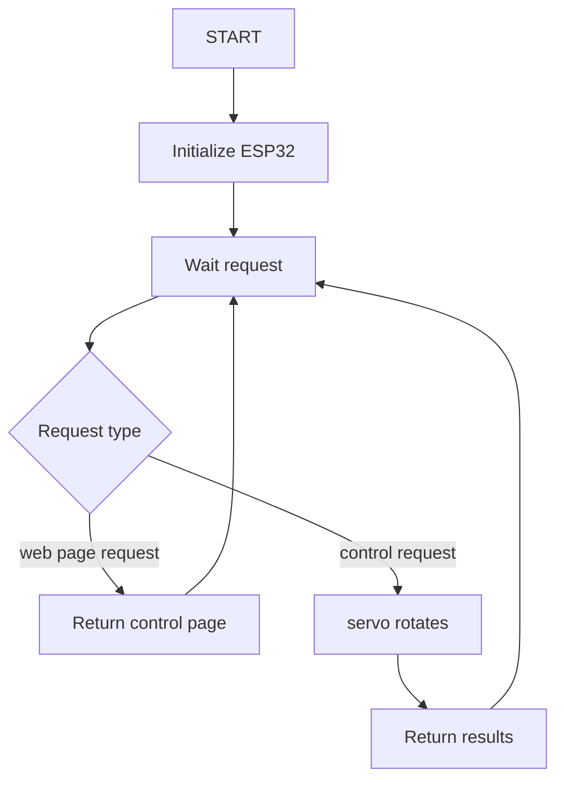
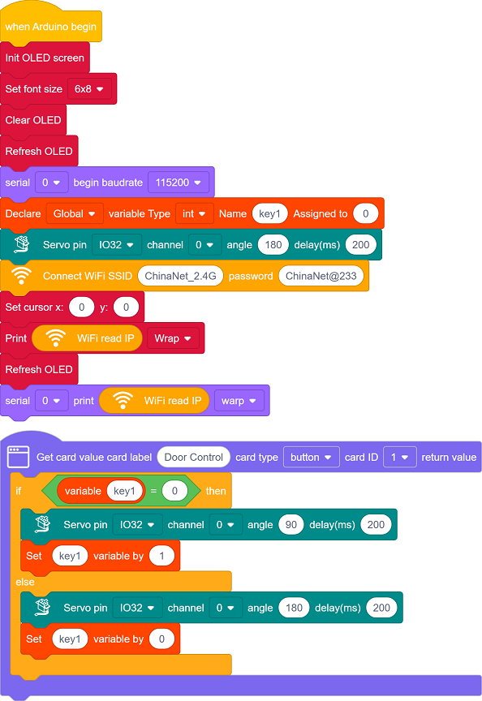
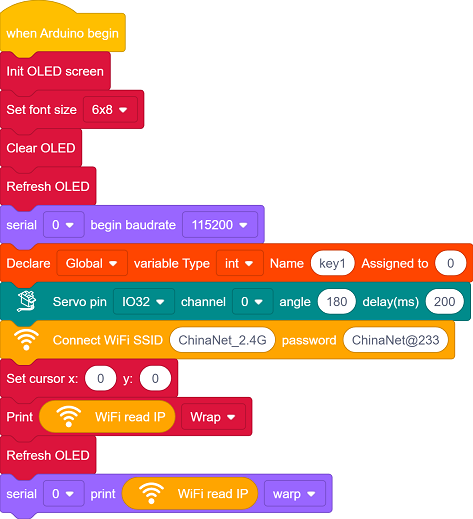
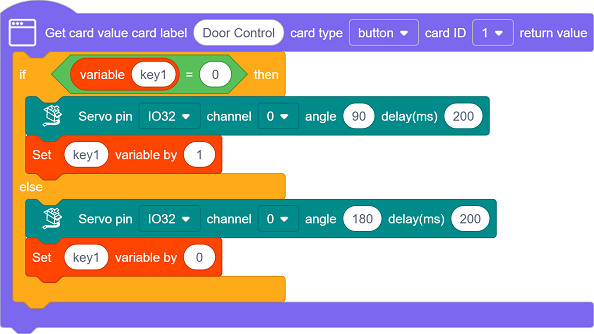
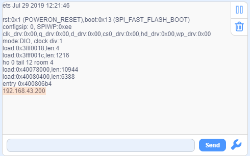
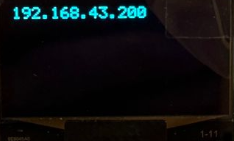
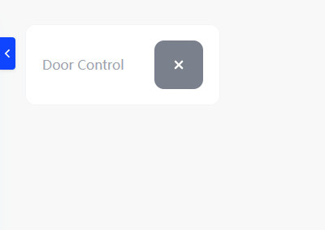
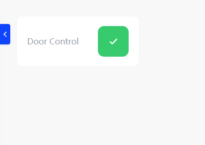

## 13.Web Page Remote Control Gate

In smart school era, smart management and remote interconnection are becoming important symbols of its modernization. In this project, with the theme of Remote Control of School Gate, we will guide you to deeply explore the innovative application of Internet of Things in school security management.

From now on, let’s protect the school with technology, build a smart management with innovation, and jointly explore the infinite possibilities of Internet of Things in education!

#### Principle

**Mobile browser → WiFi → ESP32 → Control servo rotation → Gate open/close**

1. **Mobile phone/PC** : Enter the web page to input ESP32 IP address
2. **Tap the button** (to open/close the door)
3. **ESP32 receives instructions** (through WiFi)
4. **Servo rotates** (to 180° or 90° to close or open the gate)

#### Code Flow

#### Test Code

#### Code Explanation

**Here covers extracurricular knowledge of HTML, CSS, and JS, so we only provide a brief introduction.**

Click  to choose the extension. Search the following extension to load it.

Back to the editing area after it is loaded.

- Initialize the OLED and serial port, and set servo to 180°, the gate to close state initially.

- Set the WiFi name and password, and connect to WiFi. Then print the IP address on the OLED and the serial monitor.

	Please replace the WiFi name and password in the code with yours.

- There are a button component on the page: **Door Control**
- Tap the button to open/close the door.

#### Test Result

1. After uploading the code, open the serial monitor and set the baud rate to 115200. You can see the printed IP information:

   

   The IP address will also be printed on the OLED at the same time.

   

2. Enter this IP address in the browser of your mobile phone or computer to access the door control page.

   Note: Make sure your mobile phone/computer and ESP32 are connected to the same WiFi.

   

3. Tap  to open the door.

	

#### FAQ

1. If nothing is printed on the serial monitor, please press the reset button on the board.

   

2. If the ESP32 has not been able to obtain an IP address, it is usually because the WiFi connection has failed. Solutions:

   - Make sure that the WiFi name and password in the code have been replaced with yours.
   - Make sure your WiFi network is 2.4GHz. ESP32 does not support 5GHz WiFi.

3. If there is no page when entering the IP address,

	- Make sure the IP address is entered correctly.
	- Check whether your mobile phone/computer is on the same network as the ESP32.