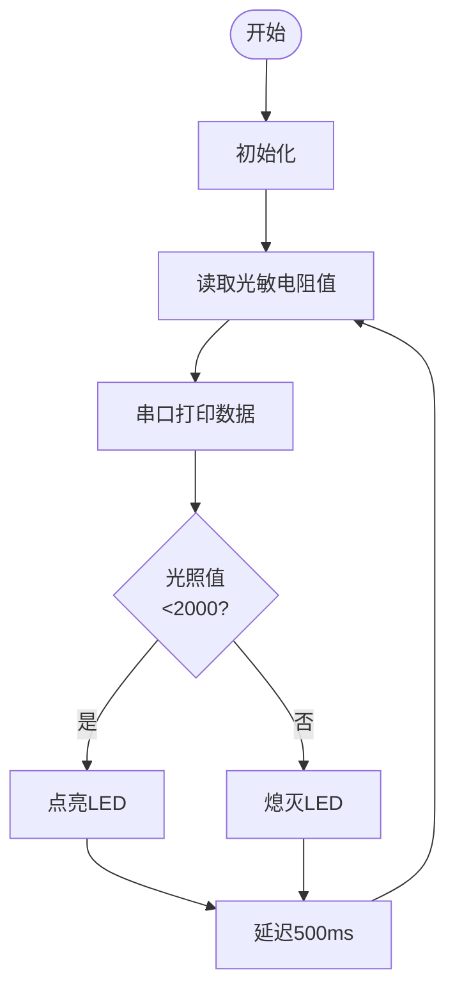

## 1. 校园智能节能路灯

这一课，我们利用LED灯模块和光敏电阻传感器制作智能节能路灯模型，探究光控原理，体验科技助力绿色校园。

### 1.1 白色LED模块

LED，即发光二极管的简称，发光二极管可高效地将电能转化为光能，是一种常用的发光器件。


#### 参数

工作电压 ：DC 3.3 ~ 5V

工作电流 ：1.5 mA（峰值2.3mA)

最大功率 ：0.07 W

控制信号 ：数字信号

尺寸 ：32 x 23 x 12mm

定位孔大小 ：直径为 4.8 mm

接口 ：间距2.54 mm，3pin弯针接口


#### 原理

对于这款简单的LED灯模块，可以直接使用主板的高低电平来控制LED的亮灭。

**高电平点亮LED:**

- 当输入信号为高电平（3.3V或5V）时，驱动电路会导通，使LED发光。

**低电平熄灭LED:**

- 当输入信号为低电平（0V）时，驱动电路会截止，切断供电，LED停止发光。


#### 实验代码


```c++
int ledPin = 12;  // 定义变量 ledPin，表示 LED 灯连接在 12 号引脚

void setup() {
  pinMode(ledPin, OUTPUT);  // 将 12 号引脚设置为输出模式
}

void loop() {
  digitalWrite(ledPin, HIGH);  // 点亮 LED 灯
  delay(1000);                 // 延时 1 秒
  digitalWrite(ledPin, LOW);   // 熄灭 LED 灯
  delay(1000);                 // 延时 1 秒
}
```


#### 代码说明

**1.   初始化设置**


- 这个代码块是一个事件触发器，表示当程序开始运行时，这段代码会**首先执行一次**，类似于 Arduino 原生代码的 `setup()` 函数。

<br>

**2.  主循环**


- 这个代码块是一个无限循环控制块，功能类似于 Arduino 原生代码中的 `void loop()`。它的作用是让内部的代码**重复执行，永不停止**，直到程序被手动终止或设备断电。


- 向 IO12 输出高电平，点亮 LED 灯。


- 让程序暂停 1 秒钟，LED 灯保持点亮状态1秒。


- 这段代码块的作用是让连接到 IO12 的 LED灯循环执行：亮1秒、灭1秒。


#### 实验结果

代码上传成功后，你会看到白色LED 灯以 1 秒的间隔闪烁：

- 点亮 1 秒 → 熄灭 1 秒 → 点亮 1 秒 → 熄灭 1 秒 → 循环往复。


---

### 1.2 光敏电阻传感器

光敏电阻是一种用于检测环境光强度的电子元件，通过光敏电阻将光照强度转换为电信号，常用于自动灯光控制、环境监测等场景。


#### 参数

工作电压 : DC 3.3 ~ 5V 

电流 : 20 mA

最大功率 : 0.1 W

工作温度 ：-10°C ~ +50°C

输出信号 : 模拟信号

尺寸 ：32 x 23 x 8mm

定位孔大小：直径为 4.8 mm

接口 ：间距2.54 mm，3pin弯针接口


#### 原理


光敏电阻传感器模块的输出是**模拟信号**（连续变化的电压），而ESP32需要通过**ADC**将其转换为**数字信号**，以便程序进行处理。

- **什么是ADC?**

- ADC是一种将模拟信号（连续信号）转换为数字信号（离散信号）的设备。在单片机系统中，ADC的作用是将来自传感器或其他模拟设备的信号转换为单片机能够处理的数字数据。

  

**光敏电阻模块的信号输出**

光敏电阻传感器模块通常包含：

- **光敏电阻（光照越强，电阻越小）**
- 分压电路（将电阻变化转换为电压变化）

**分压电路工作原理**：


- 输出电压（Vout）取自光敏电阻两端：

  <font face="courier New" color="black" size=5.5>$Vout = VCC ×（\frac {R_{LDR}}{R_1 + R_{LDR}}）$ </font> 

- 光照变化 → R_light变化 → V_out变化：

  - 光照增强 → $R_{LDR}$ ↓ → $V_{out}$ ↓ 
  - 光照减弱 → $R_{LDR}$ ↑ → $V_{out}$ ↑


#### 实验代码


#### 代码说明

**1.   初始化设置**


- 初始化串口通信，设置波特率为115200。
- 定义一个int型变量sensorValue，和一个double型变量voltage。

<br>

**2.  主循环**


- 读取光敏电阻传感器的模拟值（0~4095）。


- 将模拟值转换为电压值（0~3.3V）。

- 将 ADC 读取的数字值（`sensorValue`）转换为实际的电压值（`voltage`）公式：

  <font face="courier New" color="black" size=5.5>$voltage = sensorValue ×（\frac {参考电压}{ADC最大数字值}）$ </font> 

  对于我们这款主板：

  - 参考电压 = 3.3V
  - ADC 最大数字值 = 4095


- 将读取的值打印到串口监视器，每0.5秒更新。


#### 实验结果

代码上传成功后，单击, 波特率选择115200 。


用手掌捂住光敏电阻传感器，然后慢慢松开手掌，可以看到打印数据：


总结：

- 当光照强度增加时，传感器输出的模拟值（0~4095）增大，电压值（0~3.3V）也增大。
- 当光照强度减小时，传感器输出的模拟值和电压值减小。

---

### 1.3 校园智能节能路灯

在前面两小节课程中，我们已经学习了 LED 模块和光敏模块的基本原理与使用方法。现在，让我们将这些知识结合起来，动手制作一个校园智能节能路灯！通过这个项目，我们将实现一个能够根据环境光照强度自动调节灯光的智能系统，既节能环保，又充满科技感。

接下来，我们将一步步完成代码编写和功能调试，最终打造出一个实用的智能路灯原型。让我们一起开启这段充满创意与挑战的旅程吧！

==椴木板实拍图==


#### 流程图




#### 实验代码


#### 代码说明

**1.   初始化设置**


- 初始化串口通信，设置波特率为115200。
- 定义一个int型变量sensorValue，和一个double型变量voltage。

<br>

**2.  主循环**


- 读取光敏电阻传感器的模拟值，将模拟值转换为电压值，将这两个值打印到串口监视器。


   - 这段代码是一个简单的 条件控制语句，用于根据传感器读取的值（`sensorValue`）与设定的阈值200进行比较，从而控制 LED 灯的亮灭。阈值可以根据实际情况进行更改，每0.5秒判断一次。
     - 当光照低于阈值，自动点亮LED
     - 当光照高于阈值，自动关闭LED


#### 实验结果

代码上传成功后，当光照低于阈值时点亮路灯；当光照高于阈值时关闭路灯，实现节能的效果。

==动图==

智能节能路灯就制作完成啦，让我们一起用科技点亮绿色校园，为环保贡献一份力量！