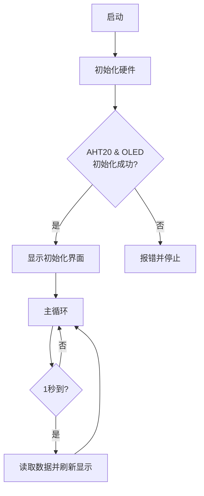

## 3. 智能教室温湿度计

让我们用 AHT20 温湿度传感器和 OLED 屏幕模块，打造一个智能教室温湿度监测系统，实时显示环境数据，为师生创造一个舒适健康的学习环境！

### 3.1 AHT20温湿度传感器

AHT20 基于电容式湿度测量和热敏电阻温度测量原理，能够实时检测环境温湿度，并将数据通过 I²C 接口输出，为环境监测和智能控制提供精准数据支持。

#### 参数

工作电压 ：DC 3.3 ~ 5V 

通讯接口 ：I2C

I2C地址 ：0x38

温度范围 ：-10°C ~ +50°C

湿度范围 ：0% ~ 100% RH

尺寸 ：32 x 23 x 8mm

定位孔大小：直径为 3.2 mm

接口 ：间距2.54 mm，4pin弯针接口

#### 原理

AHT20 基于 **电容式湿度测量** 和 **热敏电阻温度测量** 原理：

- 湿度测量：通过电容式传感器检测空气中的湿度变化，电容值随湿度变化而变化。
- 温度测量：通过热敏电阻检测环境温度，电阻值随温度变化而变化。
- 数字输出：传感器内部集成了 ADC（模数转换器）和校准电路，将模拟信号转换为数字信号，并通过 I²C 接口输出。

#### 实验代码

#### 代码说明

**1.   初始化设置**

 

**2.  主循环**

- 读取当前温度和湿度数据，返回浮点数。

- 通过串口监视器输出数据。

- 延时 2 秒(遵循传感器数据手册推荐的最小读取间隔)。

#### 实验结果

代码上传成功后，单击, 波特率选择115200 。

每 2 秒更新一次温度和湿度数据。

---

### 3.2 1.3寸  IIC  OLED屏 

OLED 屏是一种自发光显示DS技术，具有高对比度、广视角和低功耗等特点，能够显示清晰的图像和文字，广泛应用于智能设备、可穿戴设备和工业控制等领域。

==图==

#### 参数

工作电压 ：DC 3.3 ~ 5V 

驱动芯片 ：SH1106 

通讯接口 ：I2C

分辨率 ：128*64

尺寸 ：37 x 34 x 6mm

定位孔大小：30.5mm(长) 29mm（宽）

接口 ：间距2.54 mm，4pin弯针接口

#### 原理

**OLED 屏的工作原理**

- **自发光**：OLED 屏的每个像素由有机发光材料组成，当电流通过时，像素会发光，无需背光。
- **像素控制**：通过控制每个像素的电流，可以调节其亮度，从而实现图像的显示。
- **驱动芯片**：内置驱动芯片 SH1106，负责接收控制信号并驱动像素。

**OLED 屏的控制原理**

OLED 屏的控制原理基于 **显存（GRAM）** 和 **通信协议**：

- **显存（GRAM）**：
  - OLED 屏内置显存，用于存储当前显示的图像数据。
  - 通过向显存写入数据，可以更新屏幕内容。
- **通信协议**：
  - 通过 I²C 接口发送命令和数据，控制 OLED 屏的工作模式和显存内容。
  - 常用命令包括初始化、清屏、设置光标位置、写入数据等。

#### 实验代码

#### 代码说明

- 初始化OLED显示屏
- 清屏
- 设置文本大小
- 设置起始位置
- 写入 "Hello world!" 到缓冲区

- 更新到屏幕

  这个代码块必须调用！

  所有绘图指令仅停留在内存，未发送到硬件，调用此代码块后才会实际更新显示。

#### 实验结果

代码上传成功后，在 OLED 屏幕中间可以看到打印的 “Hello world!” ：

==图==

#### 常见问题解决

1. 代码上传不成功？
   - 确保IIC接线正确

---

### 3.3 智能教室温湿度计

在前期的学习中，我们已经熟悉了 OLED显示屏 的文字显示技术，并掌握了 AHT20高精度温湿度传感器 的数据采集方法。现在，让我们将这两项技术深度融合，打造一个智能教室温湿度计！

通过本课程，我们将构建一个能实时追踪教室 温度 和 相对湿度 的智能监测站。系统会通过OLED屏幕清晰显示：

- 实时温度数值（℃）
- 当前湿度百分比（%）

现在，让我们开始这场环境感知技术的实践之旅吧！

#### 流程图

#### 实验代码

#### 代码说明

**1.   初始化设置**

- 初始化OLED显示屏、清屏、设置文本大小
- 定义变量 temperature、humidity

 

**2.  主循环**

- 传感器采集温湿度值

- 清屏，设置起始位置，温湿度值显示
- 屏幕刷新，每2秒更新一次

#### 实验结果

代码上传成功后，AHT20传感器每2秒读取一次温湿度数值，并显示在OLED屏上。

