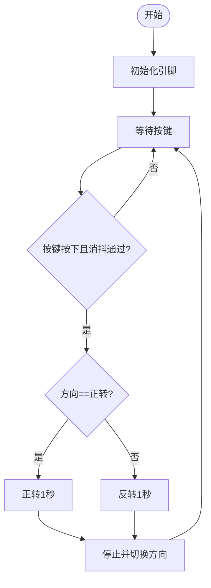

## 5. 智能旗帜升降台

让我们用直流减速电机和单路按键模块打造一个智能旗帜升降台，通过按键控制实现旗帜的自动升降，体验科技与工程的完美结合！

### 5.1 直流减速电机

直流双轴减速马达是一种常见的电机类型，由直流电机和减速箱组合而成，具有两个输出轴。


#### 参数

工作电压 ：DC 3.3 ~ 5V 

空载转速 ：10-500 RPM

负载转速 ：5-300 RPM

输出扭矩 ：0.1-50 kg·cm

工作温度 ：-10°C ~ +50°C

尺寸 ：70 x 22.3 x 19mm                                                                                                                                                                                                                                                                                                                                                                                                                                                                                                                                                


#### 原理

直流电机通过电刷和换向器将电能转换为机械能，直接输出时为高转速（通常几千至上万RPM）、低扭矩特性；其后连接的减速齿轮箱通过3-6级齿轮组逐级减速（减速比1:10~1:1000），在降低转速的同时按比例放大扭矩，最终通过同步传动的双输出轴输出低速高扭矩动力，两轴转速和扭矩保持高度同步（误差小于5%），从而满足设备对精准低速和大扭矩驱动的需求。


#### L9910S 电机驱动板


直流减速电机需要外部驱动模块，因为：

1. 需要大电流驱动（远超单片机IO能力）
2. 会产生反电动势（可能损坏控制电路）
3. 需H桥实现正反转控制

我们选择了 L9110S 驱动板，能完美解决这些问题：

- 提供1.8A驱动电流
- 集成H桥和保护电路
- 支持PWM调速
- 只需简单数字信号控制

**参数**

工作电压 ：DC 5V 

安装孔直径 ：3mm

尺寸 ：25 x 19 x 13mm 

**基本控制逻辑**

L9910S 通过两个逻辑输入引脚 ( INA 和 INB )控制电机状态，其真值表如下：

| INA  | INB  | 电机状态 | 输出模式       |
| ---- | ---- | -------- | -------------- |
| L    | L    | 停止     | Hi-Z(高阻态)   |
| H    | L    | 正转     | OUTA=H, OUTB=L |
| L    | H    | 反转     | OUTA=L, OUTB=H |
| H    | H    | 刹车     | OUTA=L, OUTB=L |

**PWM调速控制**

9910S 支持PWM调速控制，有两种衰减模式：

- 快衰减模式：如同自行车突然放开踏板，靠惯性滑行停止（自由滑行停止）
  - 一个PWM输入，另一个输入保持低电平

- 慢衰减模式：如同自行车轻捏刹车闸缓慢减速（受控减速）
  - 一个PWM输入，另一个输入保持高电平

| 控制方式      | INA  | INB  | 适用场景           |
| ------------- | ---- | ---- | ------------------ |
| 正转PWM快衰减 | PWM  | 0    | 快速减速，响应灵敏 |
| 正转PWM慢衰减 | PWM  | 1    | 平滑调速，减少震动 |
| 反转PWM快衰减 | 0    | PWM  | 快速反向制动       |
| 反转PWM慢衰减 | 1    | PWM  | 平稳反向运行       |


#### 实验代码


#### 代码说明


- 初始化，等待8秒，用于调整旗帜，若时间不够可以延长。


- 循环执行：**正转1秒→停止2秒→反转1秒→停止2秒** 的动作序列。
  - **正转/反转**：通过 INA / INB 高低电平组合控制方向（HIGH/LOW）
  - **停止**：双低电平切断动力，电机自由停止

- 电机状态控制

  正转：`INA=HIGH`, `INB=PWM(0%)` → 相当于`INB=LOW`

  反转：`INA=LOW`, `INB=PWM(100%)` → 相当于`INB=HIGH`

  停止：`INA=LOW`, `INB=PWM(0%)` → 相当于`INB=LOW`

  

#### 实验结果

代码上传成功后等待8秒，用于调整旗帜至下图所示位置：


随后电机循环执行：

正转1秒 → 停止2秒 → 反转1秒 → 停止2秒

可以看到每2秒旗帜升起或下降。

<span style="color: rgb(50, 0, 200);">注意：由于固定转轴的橡胶圈摩擦力会随着使用逐渐减弱，长期运行后会出现轻微打滑。这会导致每次升旗到顶端时，国旗的位置都会比上一次偏移一点，就像自行车链条打滑时踏板会空转一样。</span>

---


### 5.2 单路按键模块

单路按键模块是一种简单实用的输入设备，通过按下或松开按键输出高低电平信号，常用于控制开关、状态切换和用户交互等场景。


#### 参数

工作电压 ：DC 3.3 ~ 5V 

工作电流 ：1.1 mA

最大功率  ：0.0055 W

工作温度 ：-10°C ~ +50°C

输出信号 ：数字信号

尺寸 ：32 x 23 x 15mm

定位孔大小 ：直径为 4.8 mm

接口 ：间距2.54 mm，3pin弯针接口


#### 原理


单路按键模块的核心是一个机械按键，其工作原理基于 **电平变化**：

- 按键未按下：
  - 按键模块的输出引脚通过上拉电阻保持高电平（5V）。
- 按键按下：
  - 按键闭合，输出引脚接地，电平变为低电平（0V）。
- 按键松开：
  - 按键断开，输出引脚恢复高电平。

**注意事项**

按键在按下或松开时可能会产生抖动，导致误触发。可以通过软件防抖（如延时）解决。


#### 实验代码


```c++
int val = 0;             // 用于存储键值
int button = 26;         // 将按钮的引脚连接到IO26

void setup() {
  Serial.begin(115200);      
  pinMode(button, INPUT);    
}

void loop() {
  val = digitalRead(button);  // 读取按键的值
  Serial.print(val);          // 打印
  if (val == 0) {             // 按下按钮时读取到低电平，并打印出相关的信息
    Serial.println("\t Press the botton");
    delay(100);
  }

  else {                      // 打印按钮的释放信息
    Serial.println("\t Loosen the botton");
    delay(100);
  }
}
```


#### 代码说明


- 串口初始化


- 检测连接到 GPIO 26 的按钮状态

- 通过串口打印按钮的实时状态，每0.1秒刷新一次
  - 按下
  - 释放


#### 实验结果

代码上传成功后，单击, 波特率选择115200 。


循环检测：

- 不断读取按钮引脚的状态。
- 如果按钮被释放（读取到高电平），输出 `Loosen the botton`。
- 如果按钮被按下（读取到低电平），输出 `Press the botton`。
- 每次检测后延时 100 毫秒，防止按钮抖动。


---


### 5.3 智能旗帜升降台

在前面两小节课程中，我们已经学习了直流减速电机和按键模块的基本原理与使用方法。现在，让我们将这些知识结合起来，动手制作一个智能旗帜升降台！通过这个项目，我们将实现一个能够通过按键控制旗帜自动升降的智能系统，既便捷高效，又充满科技感。

接下来，我们将一步步完成硬件连接、代码编写和功能调试，最终打造出一个实用的智能旗帜升降台。让我们一起开启这段充满创意与挑战的旅程吧！


#### 流程图




#### 实验代码


```c++
const int INA = 5;
const int INB = 13;
const int buttonPin = 26; // 按键引脚

int currentDirection = 1; // 1=正转 2=反转
bool motorRunning = false;
unsigned long lastDebounceTime = 0;
const int debounceDelay = 50;

void setup() {
  pinMode(INA, OUTPUT);
  pinMode(INB, OUTPUT);
  pinMode(buttonPin, INPUT);
}

void loop() {
  int buttonReading = digitalRead(buttonPin);
  
  // 检测按键按下（下降沿）
  if (buttonReading == LOW && millis() - lastDebounceTime > debounceDelay) {
    lastDebounceTime = millis();
    
    if (!motorRunning) {
      if (currentDirection == 1) {
        digitalWrite(INA, HIGH); // 正转
        digitalWrite(INB, LOW);
      } else {
        digitalWrite(INA, LOW); // 反转
        digitalWrite(INB, HIGH);
      }
      
      motorRunning = true;
      delay(1000); // 运行1秒
      
      digitalWrite(INA, LOW);
      digitalWrite(INB, LOW);
      motorRunning = false;
      
      // 切换下次方向
      currentDirection = (currentDirection == 1) ? 2 : 1; 
    }
  }
}
```


#### 代码说明


- 定义变量 `buttonReading` 用来判断按键状态
- 变量 `currentDirection` 用来判断当前方向


- 按键检测与消抖，只有按键低电平（按下）持续超过50ms才视为有效，避免接触抖动导致的误触发。


这段代码实现**单路按键交替控制电机方向**的功能：

第一次按下 → 正转1秒 → 停止 → 第二次按下 → 反转1秒 → 停止 → 循环...

每次电机完成转动后，程序会自动切换方向标志（`currentDirection`），这样下次按键时，电机就会朝相反方向转动。

`currentDirection`：

- `0` → 正转 → 降旗
- `1` → 反转 → 升旗


#### 实验结果

代码上传成功后，单路按键模块交替控制升降动作：

- 按一次升起旗帜
- 再按一次降落旗帜
- 循环以上动作


==动图==